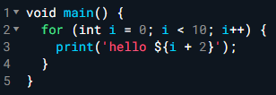
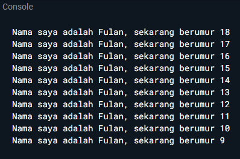

# CodeLab 02 — Pengantar Dart (Bagian 1)

**Nama:** Petrus Tyang A.R
**NIM:** 2341720227
**Mata Kuliah:** Pemrograman Mobile
**Kelas:** TI 3G


## Soal 1

**Modifikasilah kode pada baris 3 agar output sesuai permintaan.**

### Soal & Contoh



**Output yang diminta (ganti *Fulan* dengan nama Anda):**


### Jawaban Saya

**Kode yang saya tulis:**

```dart
void main() {
  const name = 'petrus Tyang A.R';
  for (var age = 18; age >= 9; age--) {
    print('Nama saya adalah $name, sekarang berumur $age');
  }
}
```

**Tangkapan layar eksekusi:**
.png)


> Catatan: Pastikan nama sudah diganti menjadi **petrus Tyang A.R** seperti di atas.

---

## Soal 2

**Mengapa penting memahami Dart sebelum Flutter?**

Flutter adalah toolkit UI, sedangkan “otaknya” adalah **Dart**. Seluruh widget, lifecycle, dan pengelolaan state ditulis dengan konsep serta fitur Dart (class, generics, null-safety, collection/spread/cascade, `const`, string interpolation). Hampir semua tugas Flutter—memuat data, animasi, dan I/O—mengandalkan asinkron Dart (**Future**, `async/await`, **Stream**). Performa aplikasi juga terkait mode kompilasi Dart (**JIT** untuk dev dengan hot reload, **AOT** untuk rilis), serta paralelisme lewat **Isolate**. Tanpa dasar Dart yang kuat, mudah salah pakai `setState`/stream, bingung membaca struktur widget, rawan bug null, dan sulit mengikuti pola state management (Provider/BLoC/Riverpod). Maka, kuasai Dart dulu agar belajar Flutter lebih cepat, rapi, dan minim error.

---

## Soal 3

**Ringkasan materi codelab yang relevan untuk Flutter**

* **Dart adalah inti Flutter**: dipilih karena toolchain produktif, garbage collection, **type safety** dengan inference, dan portabilitas (bisa ke JavaScript & native ARM/x86). Paham Dart = produktivitas lebih baik di Flutter.
* **Jalur eksekusi**: berjalan di **Dart VM** atau dikompilasi ke **JavaScript**.
* **JIT vs AOT**: JIT (dev) → **hot reload** & debug cepat; AOT (rilis) → performa tinggi. Ketahui kapan memakai masing-masing.
* **OOP murni**: semua tipe adalah objek. Titik masuk program selalu `main()`. **Function** berdiri sendiri, **method** terikat ke instance (`this`).
* **Operator penting**: `~/` untuk integer division; `==` membandingkan **isi** (bukan alamat objek). Operator logika `!`, `||`, `&&` seperti biasa.
* **Mulai praktis**: coba di **DartPad** atau lokal dengan `dart <file.dart>`. Latihan rutin agar sintaks Dart terasa natural saat menulis widget & state di Flutter.

---

## Soal 4

**Perbedaan Null Safety dan `late` variabel (penjelasan & contoh kode)**

### Null Safety (nullable vs non-nullable)

* Secara default, variabel **tidak boleh null**.
* Jika ingin boleh null, gunakan tipe dengan tanda tanya `T?` dan **wajib** ditangani sebelum dipakai (`if`, `??`, `?.`, atau `!`).

**Kode & Output:**

```dart
void main() {
  // Non-nullable
  String name = 'Petrus';
  // name = null; // ❌ compile error

  // Nullable
  String? nickname;
  print('Nickname awal: ${nickname?.toUpperCase() ?? "(tidak ada)"}');

  nickname = 'tyang';
  print('Nickname setelah diisi: ${nickname!.toUpperCase()}'); // '!' yakin tidak null
}
```

*Cuplikan hasil:*


### `late` variabel

* Menandakan variabel **non-nullable** akan **diinisialisasi belakangan**, tetapi **harus** sudah diisi sebelum dipakai.
* Jika diakses sebelum diisi → **`LateInitializationError`**.
* `late final` cocok untuk **lazy initialization** (nilai dihitung saat pertama kali diakses).

**Kode & Output:**

```dart
void main() {
  late String token; // non-nullable, diisi nanti
  // print(token);   // ❌ runtime error jika belum diisi

  token = 'abc123';
  print('Token: $token'); // ✅ aman
}
```

*Cuplikan hasil:*
.png)
.png)

### Ringkas Perbedaan

| Topik              | Null Safety (`T?`)          | `late T`                                             |
| ------------------ | --------------------------- | ---------------------------------------------------- |
| Boleh null?        | Ya (nilai bisa `null`)      | Tidak (wajib ada nilai)                              |
| Waktu inisialisasi | Bisa kapan saja             | Boleh belakangan, **sebelum dipakai**                |
| Risiko umum        | Lupa menangani `null`       | `LateInitializationError` jika diakses sebelum diisi |
| Kasus pakai        | Data opsional (bisa kosong) | Nilai pasti ada, tapi didapat belakangan / lazy init |

---

## Catatan Akhir

* Simpan semua gambar di folder `img/` agar tautan tidak putus.
* Gunakan pesan commit yang rapi, misalnya:
  `docs: perbaiki README CodeLab 02 & tambah cuplikan hasil`
