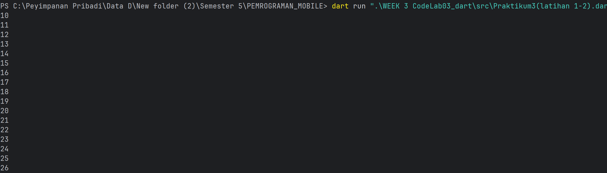

# Praktikum Dart — Percabangan & Perulangan

> **Mata Praktikum:** Struktur Kontrol (if/else, while, do–while, for, break/continue) & Tugas Bilangan Prima
>
> **Bahasa:** Dart • **Penulis:** Petrus Tyang A.R (NIM 2341720227)

---

## Daftar Isi

* [Cara Menjalankan](#cara-menjalankan)
* [Praktikum 1 — If/Else](#praktikum-1--ifelse)
* [Praktikum 2 — While & Do–While](#praktikum-2--while--do–while)
* [Praktikum 3 — For, Break, Continue](#praktikum-3--for-break-continue)
* [Tugas — Bilangan Prima](#tugas--bilangan-prima)
* [Catatan Penting (Best Practices)](#catatan-penting-best-practices)

---

## Cara Menjalankan

1. Pastikan **Dart SDK** sudah terpasang.
2. Simpan setiap contoh kode pada file `.dart` (mis. `main.dart`).
3. Jalankan dengan:

   ```bash
   dart run main.dart
   ```

> **Tip:** Struktur kontrol di Dart **case-sensitive** (huruf besar/kecil berpengaruh). Gunakan `if`, `else if`, `else` (huruf kecil semua).

---

## Praktikum 1 — If/Else

### Langkah 1–2 (Perbaikan Kode & Penjelasan)

**Kode benar:**

```dart
void main() {
  String test = "test2";

  if (test == "test1") {
    print("Test1");
  } else if (test == "test2") {
    print("Test2");
  } else {
    print("Something else");
  }

  if (test == "test2") print("Test2 again");
}
```

**Output (contoh tangkapan layar):**


**Mengapa contoh awal gagal?**

* Dart **peka huruf**: kata kunci harus `if`/`else` huruf kecil. Penulisan `else If`/`Else` memicu error.
* Operator perbandingan string dengan `==` **valid** di Dart (membandingkan isi).

---

### Langkah 3 — `String` ke kondisi `bool`

**Kasus:**

```dart
String test = "true";
if (test) {
  print("Kebenaran");
}
```

Akan error karena kondisi `if` wajib bertipe **bool**. Pesan umum: *“Conditions must have a static type of 'bool'.”*

**Perbaikan (tetap pakai if/else):**

```dart
void main() {
  String test = "true"; // nilai string

  // Normalisasi agar aman terhadap kapitalisasi & spasi
  final v = test.trim().toLowerCase();

  if (v == "true") {
    print("Kebenaran");
  } else if (v == "false") {
    print("Bukan kebenaran");
  } else {
    print("Input harus 'true' atau 'false'");
  }
}
```

**Output (contoh):**


---

## Praktikum 2 — While & Do–While

### Langkah 1–2 (Deklarasi Variabel Wajib)

**Kode benar:**

```dart
void main() {
  int counter = 0;            // inisialisasi

  while (counter < 33) {
    print(counter);
    counter++;
  }
}
```

**Output (contoh):**


**Penjelasan:**

* Error awal terjadi karena `counter` **belum dideklarasi** saat digunakan.
* Di Dart, variabel lokal **harus** dideklarasi sebelum dipakai.

---

### Langkah 3 — Do–While

**Kunci konsep:** Blok `do` **selalu dieksekusi minimal sekali**, lalu kondisi dicek di bagian `while`.

**Kode lanjutan (setelah while di atas):**

```dart
void main() {
  int counter = 0;

  // Langkah 1–2
  while (counter < 33) {
    print(counter);
    counter++;
  }

  // Langkah 3 – do-while
  do {
    print(counter);
    counter++;
  } while (counter < 77);
}
```

**Output (contoh):**


**Catatan:** Jika potongan `do–while` berdiri sendiri tanpa deklarasi `counter`, akan error: **Undefined name 'counter'**.

---

## Praktikum 3 — For, Break, Continue

### Langkah 1–2 (Perbaikan Penulisan & Increment)

**Kode salah (awal):**

```dart
for (Index = 10; index < 27; index) {
  print(Index);
}
```

Masalah:

* `Index` ≠ `index` (beda kapital) → **error**.
* Increment hanya `index` (tanpa `++`) → berpotensi **infinite loop**.

**Kode benar:**

```dart
void main() {
  for (int index = 10; index < 27; index++) {
    print(index);
  }
}
```

**Output (contoh):**



---

### Langkah 3 — Break & Continue

**Instruksi awal (salah kapitalisasi & variabel):**

```dart
If (Index == 21) break;
Else If (index > 1 || index < 7) continue;
print(index);
```

**Perbaikan (tetap for + break/continue):**

```dart
void main() {
  for (int index = 10; index < 27; index++) {
    if (index == 21) break;
    else if (index > 1 || index < 7) continue;
    print(index);
  }
}
```

**Apa yang terjadi?**

* Kondisi `index > 1 || index < 7` untuk rentang `10…26` **selalu true** (karena `index > 1` true). Akibatnya `continue` **selalu lompat** ke iterasi berikutnya.
* Saat `index == 21`, `break` menghentikan loop lebih dulu.
* **Tidak ada output** yang tercetak.

> **Ingin mendemokan `continue` secara terlihat?** Ganti kondisi menjadi `index > 1 && index < 7` atau kondisi lain yang tidak selalu true pada rentang iterasi.

**Output (contoh):**


---

## Tugas — Bilangan Prima

**Kode:**

```dart
import 'dart:math';

bool isPrime(int n) {
  if (n < 2) return false;
  if (n == 2) return true;
  if (n % 2 == 0) return false;
  final limit = sqrt(n).floor();
  for (int i = 3; i <= limit; i += 2) {
    if (n % i == 0) return false;
  }
  return true;
}

void main() {
  for (int n = 0; n <= 201; n++) {
    if (isPrime(n)) {
      print('$n -> Petrus Tyang A.R, NIM 2341720227');
    }
  }
}
```

**Output (contoh tangkapan layar):**


> **Catatan performa:** Pemeriksaan hingga `√n` dan melompati bilangan genap membuat fungsi `isPrime` efisien untuk rentang angka moderat.

---

## Catatan Penting (Best Practices)

* ✅ **Case-sensitive**: Gunakan `if`, `else if`, `else` (huruf kecil) & konsisten nama variabel.
* ✅ **Deklarasi sebelum pakai**: Variabel lokal wajib dideklarasi sebelum digunakan.
* ✅ **Kondisi bertipe `bool`**: Ekspresi di `if`, `while`, dan `do…while` harus menghasilkan `bool`.
* ✅ **Waspadai infinite loop**: Pastikan ada **increment/decrement** dan kondisi **berubah**.
* ✅ **Gunakan operator logika dengan tepat**: `||` (OR) vs `&&` (AND) memengaruhi aliran `continue`/`break`.

---

> **Selesai.** README ini dirancang agar mudah dibaca, rapi, dan siap *copy–paste* ke `README.md`. Anda dapat menambahkan bagian "Lisensi" atau "Referensi" bila diperlukan.
