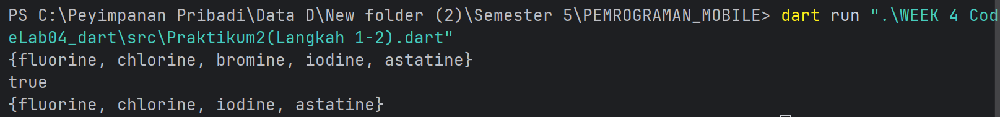
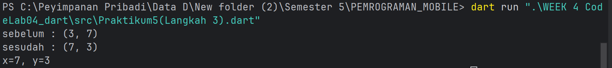

# Laporan Praktikum Dart — Koleksi & Records

> **Catatan**: Konten, kode, dan jawaban **tidak diubah**; hanya penataan dan pemformatan yang diperindah agar rapi, konsisten, dan mudah dibaca.

---

## Daftar Isi

* [Praktikum 1: Eksperimen Tipe Data List](#praktikum-1-eksperimen-tipe-data-list)
* [Praktikum 2: Eksperimen Tipe Data Set](#praktikum-2-eksperimen-tipe-data-set)
* [Praktikum 3: Eksperimen Tipe Data Maps](#praktikum-3-eksperimen-tipe-data-maps)
* [Praktikum 4: List — Spread & Control-flow Operators](#praktikum-4-eksperimen-tipe-data-list-spread-dan-control-flow-operators)
* [Praktikum 5: Eksperimen Tipe Data Records](#praktikum-5-eksperimen-tipe-data-records)
* [Tugas Praktikum](#tugas-praktikum)

---

## Praktikum 1: Eksperimen Tipe Data List

### Langkah 1 — Kode

```dart
var list = [1, 2, 3];
assert(list.length == 3);
assert(list[1] == 2);
print(list.length);
print(list[1]);

list[1] = 1;
assert(list[1] == 1);
print(list[1]);
```

### Langkah 2 — Run & Penjelasan

**Jawab:**

kenapa tidak bisa karena kode nya belum dibungkus didalam main() sehingga tidak ada entry poin kamu

### Langkah 3 — Modifikasi (final, panjang 5, default `null`)

```dart
void main() {
    // List final panjang 5, semua elemen awalnya null
    final List<String?> list = List<String?>.filled(5, null, growable: false);

    // Isi nama (index 1) dan NIM (index 2)
    list[1] = 'Petrus Tyang A.R';
    list[2] = '2341720227';

    // Validasi (opsional saat dev)
    assert(list.length == 5);
    assert(list[1] == 'Petrus Tyang A.R');
    assert(list[2] == '2341720227');
    assert(list[0] == null && list[3] == null && list[4] == null);

    // Tampilkan hasil
    print('length: ${list.length}');
    for (var i = 0; i < list.length; i++) {
    print('index[$i]: ${list[i]}');
    }
}
```

---

## Praktikum 2: Eksperimen Tipe Data Set

### Langkah 1 — Kode

```dart
var halogens = {'fluorine', 'chlorine', 'bromine', 'iodine', 'astatine'};
print(halogens);
```

### Langkah 2 — Run, Perbaiki, & Penjelasan

**Input code**

```dart
void main() {
// Versi eksplisit (lebih jelas tipenya)
final Set<String> halogens = {'fluorine', 'chlorine', 'bromine', 'iodine', 'astatine'};
print(halogens); // {fluorine, chlorine, bromine, iodine, astatine}

// Contoh operasi umum:
print(halogens.contains('iodine')); // true
halogens.add('fluorine'); // duplikat: set tetap sama
halogens.remove('bromine');
print(halogens);
}
```

**output code**



**Penjelasan**

saat dijalankan program membuat sebuah himpunan

### Langkah 3 — Tipe Literal, Perbaikan, & Tambahan Elemen

```dart
var names1 = <String>{};
Set<String> names2 = {}; // This works, too.
var names3 = {}; // Creates a map, not a set.

print(names1);
print(names2);
print(names3);
```

**Apa yang terjadi ?**


terjadi error Set<String> names2 = {}; karena literal {} sebagai map bukan set
Pesan error umumnya: tipe Map tidak bisa di-assign ke Set<String>.

**Perbaiki namun tetap gunakan ketiga variabel tersebut (Map dihapus selanjutnya).**

**Input Code**

```dart
void main() {
    // Dua Set kosong
    final Set<String> names1 = <String>{};
    final Set<String> names2 = <String>{};

    // Tambah pakai .add()
    names1.add('Petrus Tyang A.R');
    names1.add('2341720227');

    // Tambah pakai .addAll()
    names2.addAll(['Petrus Tyang A.R', '2341720227']);

    // Dokumentasi hasil (console)
    print('names1: $names1'); // {Petrus Tyang A.R, 2341720227}
    print('names2: $names2'); // {Petrus Tyang A.R, 2341720227}
}
```

**output code**


---

## Praktikum 3: Eksperimen Tipe Data Maps

### Langkah 1 — Kode

```dart
var gifts = {
// Key:    Value
'first': 'partridge',
'second': 'turtledoves',
'fifth': 1
};

var nobleGases = {
2: 'helium',
10: 'neon',
18: 2,
};

print(gifts);
print(nobleGases);
```

### Langkah 2 — Run, Perbaiki, & Penjelasan

**Input code**

```dart
void main() {
    final Map<String, Object> gifts = {
        'first': 'partridge',
        'second': 'turtledoves',
        'fifth': 1,
    };

    final Map<int, Object> nobleGases = {
        2: 'helium',
        10: 'neon',
        18: 2,
    };
    print(gifts);
    print(nobleGases);
}
```

**output code**


**Penjelasan:**

Saat dijalankan (di dalam main()), kode itu tidak error. Program membuat dua Map literal:

gifts bertipe inferensi Map\<String, Object> (karena nilainya campur String dan int),
nobleGases bertipe Map\<int, Object> (nilai juga campur String dan int),

### Langkah 3 — Tambahan Kode, Normalisasi, & Dokumentasi

Tambahkan kode program berikut, lalu coba eksekusi (Run) kode Anda.

```dart
var mhs1 = Map<String, String>();
gifts['first'] = 'partridge';
gifts['second'] = 'turtledoves';
gifts['fifth'] = 'golden rings';

var mhs2 = Map<int, String>();
nobleGases[2] = 'helium';
nobleGases[10] = 'neon';
nobleGases[18] = 'argon';
```

**Apa yang terjadi ?**

gifts dan nobleGases diseragamkan nilainya menjadi String.
mhs1 (Map\<String, String>) dan mhs2 (Map\<int, String>) dibuat kosong lalu diisi.
Setelah dijalankan, keempat map berisi pasangan nama dan NIM sesuai tipe kuncinya.

**Input Code**

```dart
void main() {
// Langkah 1 — izinkan nilai campuran (String / int) dulu
final Map<String, Object> gifts = {
'first': 'partridge',
'second': 'turtledoves',
'fifth': 1, // masih int di awal
};

final Map<int, Object> nobleGases = {
2: 'helium',
10: 'neon',
18: 2, // masih int di awal
};

print('=== Langkah 1 ===');
print('gifts: $gifts');
print('nobleGases: $nobleGases');

// Langkah 3 — map baru
final mhs1 = <String, String>{};
final mhs2 = <int, String>{};

// Normalkan gifts -> semua String
gifts['first'] = 'partridge';
gifts['second'] = 'turtledoves';
gifts['fifth'] = 'golden rings';

// Normalkan nobleGases -> semua String
nobleGases[2] = 'helium';
nobleGases[10] = 'neon';
nobleGases[18] = 'argon';

// Tambah nama & NIM ke SEMUA map
gifts['name'] = 'Petrus Tyang A.R';
gifts['nim']  = '2341720227';

nobleGases[99]  = 'Petrus Tyang A.R';
nobleGases[100] = '2341720227';

mhs1['name'] = 'Petrus Tyang A.R';
mhs1['nim']  = '2341720227';

mhs2[1] = 'Petrus Tyang A.R';
mhs2[2] = '2341720227';

print('\n=== Setelah Langkah 3 ===');
print('gifts: $gifts');         // semua value sudah String
print('nobleGases: $nobleGases'); // semua value sudah String
print('mhs1: $mhs1');
print('mhs2: $mhs2');
}
```

**Output Code**


---

## Praktikum 4: Eksperimen Tipe Data List — Spread dan Control-flow Operators

### Langkah 1 — Kode, Perbaiki, & Jalankan

```dart
var list = [1, 2, 3];
var list2 = [0, ...list];
print(list1);
print(list2);
print(list2.length);
```

**Jawaban**

kenapa terjadi error? karena error kompilasi Undefined name 'list1' karena mencetak list1 yang belum dideklarasikan.

**Input Code:**

```dart
void main() {
var list1 = [1, 2, 3];
var list2 = [0, ...list1];

print(list1);        // [1, 2, 3]
print(list2);        // [0, 1, 2, 3]
print(list2.length); // 4
}
```

**Output code:**


### Langkah 3 — Null, Null-aware Spread, & NIM

Tambahkan kode program berikut, lalu coba eksekusi (Run) kode Anda.

```dart
list1 = [1, 2, null];
print(list1);
var list3 = [0, ...?list1];
print(list3.length);
```

**Jawab:**

list1 = \[1, 2, null]; akan error jika sebelumnya list1 bertipe List<int> (mis. dideklarasikan var list1 = \[1,2,3];) karena elemen null tidak boleh masuk ke tipe int.
dan var list3 = \[0, ...?list1]; tidak menghapus elemen null di dalam list; ...? hanya aman saat seluruh list1 bernilai null.

**Input Code:**

```dart
void main() {
    // Agar bisa menampung null di langkah 3, pakai List<int?> sejak awal
    List<int?> list1 = [1, 2, 3];
    var list2 = [0, ...list1];
    print(list1);         // [1, 2, 3]
    print(list2);         // [0, 1, 2, 3]
    print(list2.length);  // 4

    // === Langkah 3 ===
    list1 = [1, 2, null];
    print(list1); // [1, 2, null]

    // Null-aware spread: aman jika list1 == null (tidak menambah apa-apa).
    // TAPI elemen null di dalam list tetap ikut masuk.
    List<int?> list3 = [0, ...?list1];
    print(list3.length);  // 4
    print(list3);         // [0, 1, 2, null]

    // (Opsional) Kalau mau menghapus elemen null saat di-spread:
    final list3NoNull = [0, ...list1.whereType<int>()];
    print(list3NoNull);   // [0, 1, 2]

    // Tambahkan variabel list berisi NIM menggunakan Spread Operators
    final head = ['2','3','4','1','7'];
    final tail = ['2','0','2','2','7'];
    final nim = [...head, ...tail];
    print(nim);           // [2, 3, 4, 1, 7, 2, 0, 2, 2, 7]
    print(nim.join());    // 2341720227
}
```

**Output Code:**


### Langkah 4 — `if` di dalam List (promoActive)

Tambahkan kode berikut, lalu jalankan.

```dart
var nav = ['Home', 'Furniture', 'Plants', if (promoActive) 'Outlet'];
print(nav);
```

**Jawab:**

kenapa terjadi error pada code yang diatas ini adalah jika promoActive belum di deklarasikan Undefined name 'promoActive'
PromoActive harus bertipe bool bukan yang lain

**Input code**

```dart
void main() {
    bool promoActive;

    // Kasus TRUE
    promoActive = true;
    var nav = ['Home', 'Furniture', 'Plants', if (promoActive) 'Outlet'];
    print('promoActive=true  -> $nav');   // [Home, Furniture, Plants, Outlet]

    // Kasus FALSE
    promoActive = false;
    nav = ['Home', 'Furniture', 'Plants', if (promoActive) 'Outlet'];
    print('promoActive=false -> $nav');   // [Home, Furniture, Plants]
}
```

**Output code**


### Langkah 5 — Kondisi Login (perbaikan `case` → `==`)

Tambahkan kode, lalu jalankan.

```dart
var nav2 = ['Home', 'Furniture', 'Plants', if (login case 'Manager') 'Inventory'];
print(nav2);
```

**Jawab:**

dari code diatas ini kenapa jadi error karena sintaks if (login case 'Manager') tidak valid didalam list literal
case hanya untuk swicth

**input code**

```dart
void main() {
    String login;

    // login = 'Manager'  -> 'Inventory' muncul
    login = 'Manager';
    var nav2 = ['Home', 'Furniture', 'Plants', if (login == 'Manager') 'Inventory'];
    print("login='Manager' -> $nav2"); // [Home, Furniture, Plants, Inventory]

    // login = 'Staff'    -> tidak muncul
    login = 'Staff';
    nav2 = ['Home', 'Furniture', 'Plants', if (login == 'Manager') 'Inventory'];
    print("login='Staff'   -> $nav2"); // [Home, Furniture, Plants]

    // login = 'Admin'    -> tidak muncul
    login = 'Admin';
    nav2 = ['Home', 'Furniture', 'Plants', if (login == 'Manager') 'Inventory'];
    print("login='Admin'   -> $nav2"); // [Home, Furniture, Plants]
}
```

**output code**


### Langkah 6 — Collection For

Tambahkan kode berikut, lalu jalankan.

```dart
var listOfInts = [1, 2, 3];
var listOfStrings = ['#0', for (var i in listOfInts) '#$i'];
assert(listOfStrings[1] == '#1');
print(listOfStrings);
```

**Jawab:**

Tidak ada error—kode itu jalan. collection for membuat list string dari list angka.

**input code**

```dart
void main() {
    var listOfInts = [1, 2, 3];
    var listOfStrings = ['#0', for (var i in listOfInts) '#$i'];

    assert(listOfStrings[1] == '#1'); // lulus
    print(listOfStrings);             // [#0, #1, #2, #3]
}
```

**output code**


---

## Praktikum 5: Eksperimen Tipe Data Records

### Langkah 1 — Kode & Penjelasan

```dart
var record = ('first', a: 2, b: true, 'last');
print(record)
```

**Jawab:**

untuk error ini terjadi karena baris print(record) tidak diakhiri titik koma, dan fitur record butuh Dart 3+.
Jika SDK-mu lama, akan muncul error terkait fitur record.

**input code**

```dart
void main() {
    var record = ('first', a: 2, b: true, 'last');
    
    // cetak seluruh record
    print(record); // ('first', a: 2, b: true, 'last');

    // akses elemen positional & named
    print(record.$1); // first
    print(record.$2); // last
    print(record.a);  // 2
    print(record.b);  // true
}
```

**output code**


### Langkah 3 — Fungsi `tukar` di Luar `main()`

Tambahkan kode program berikut di luar scope void main(), lalu jalankan.

```dart
(int, int) tukar((int, int) record) {
var (a, b) = record;
return (b, a);
}
```

**Jawab:**

Terjadi tidak ada error (asalkan pakai Dart 3+), fungsi tukar bekerja dengan records dan pattern matching untuk menukar dua nilai.

**input code**

```dart
// Di luar main():
    (int, int) tukar((int, int) record) {
        var (a, b) = record; // destructuring
        return (b, a);       // tukar posisi
}
void main() {
    (int, int) r = (3, 7);
    print('sebelum : $r');         // (3, 7)

    final swapped = tukar(r);
    print('sesudah : $swapped');   // (7, 3)

    // contoh akses hasil
    var (x, y) = swapped;   
    print('x=$x, y=$y');           // x=7, y=3
}
```

**output code**



### Langkah 4 — Deklarasi Record `mahasiswa`

Tambahkan kode program berikut di dalam scope void main(), lalu jalankan.

```dart
// Record type annotation in a variable declaration:
(String, int) mahasiswa;
print(mahasiswa);
```

**Jawab:**

Terjadi error jika promoActive belum dideklarasikan (Undefined name 'promoActive'). Variabel ini harus bertipe bool. Berikut versi benar dan contoh hasil saat true dan

**input code**

```dart
void main() {
    // Record positional: (String, int)
    (String, int) mahasiswa = ('Petrus Tyang A.R', 2341720227);

    // Cetak seluruh record
    print(mahasiswa);           // ('Petrus Tyang A.R', 2341720227)

    // Akses elemen positional
    print(mahasiswa.$1);        // Petrus Tyang A.R
    print(mahasiswa.$2);        // 2341720227

    // Destructuring (pattern)
    var (nama, nim) = mahasiswa;
    print('nama=$nama, nim=$nim'); // nama=Petrus Tyang A.R, nim=2341720227
}
```

**output code**


### Langkah 5 — Record `mahasiswa2`

Tambahkan kode program berikut di dalam scope void main(), lalu jalankan.

```dart
var mahasiswa2 = ('first', a: 2, b: true, 'last');

print(mahasiswa2.$1); // Prints 'first'
print(mahasiswa2.a); // Prints 2
print(mahasiswa2.b); // Prints true
print(mahasiswa2.$2); // Prints 'last'
```

**Jawab:**

Kode berjalan (butuh Dart 3+). mahasiswa2 adalah record bertipe (String, {int a, bool b}, String). Empat print awal menampilkan: 'first', 2, true, 'last'.
Perbaikan umum jika error: pastikan kode ada di dalam main(), pakai titik koma, dan SDK Dart ≥ 3 (records + \$1/a/b getters).

**input code**

```dart
void main() {
    // Record dengan 2 positional + 2 named fields
    var mahasiswa2 = ('first', a: 2, b: true, 'last');

    // Output sebelum diganti
    print(mahasiswa2.$1); // first
    print(mahasiswa2.a);  // 2
    print(mahasiswa2.b);  // true
    print(mahasiswa2.$2); // last
    
    // Ganti isi record: $1 = Nama (String), a = NIM (int)
    mahasiswa2 = ('Petrus Tyang A.R', a: 2341720227, b: true, 'last');

    // Dokumentasi hasil
    print('\nSetelah diganti:');
    print(mahasiswa2);     // ('Petrus Tyang A.R', a: 2341720227, b: true, 'last')
    print(mahasiswa2.$1);  // Petrus Tyang A.R
    print(mahasiswa2.a);   // 2341720227
    print(mahasiswa2.b);   // true  
    print(mahasiswa2.$2);  // last
}
```

**output code**


---

## Tugas Praktikum

1. **Silakan selesaikan Praktikum 1 sampai 5, lalu dokumentasikan berupa screenshot hasil pekerjaan Anda beserta penjelasannya!**
   **Jawab:**

sudah selesai

2. **Jelaskan yang dimaksud Functions dalam bahasa Dart!**
   **Jawab:**

Functions Dart adalah blcok kode yang bisa dipanggil berulang untuk menjalankan tugas
tertrntu Dart, function punya tipe bisa mengembalikan nilai dan bisa di deklarasikan
ditop-level atau di dalam class.

3. **Jelaskan jenis-jenis parameter di Functions beserta contoh sintaksnya!**

**Jawab:**

* Positional

```dart
int sum(int a, int b) => a + b;
```

* Optional positional (pakai \[], bisa diberi default)

```dart
String greet([String name = 'Guest']) => 'Hello, $name!';
```

* Named parameters (pakai {}, bisa required/default)

```dart
String makeUser({required String name, int age = 18}) => '$name ($age)';
```

* Parameter bertipe fungsi (callback)

```dart
int apply(int x, int Function(int) op) => op(x);
```

* Parameter nullable / non-nullable (null-safety)

```dart
void log(String? message) => print(message ?? '(null)');
```

4. **Jelaskan maksud Functions sebagai first-class objects beserta contoh sintaknya!**

**jawab:**

function diperlakukan seperti nilai: bisa disimpan di variabel, dikirim sebagai argumen, dan dikembalikan sebagai nilai.
Contoh code nya

```dart
// simpan ke variabel
int Function(int) square = (x) => x * x;
// kirim sebagai argumen
int applyTwice(int x, int Function(int) f) => f(f(x));

// kembalikan function (higher-order)
int Function() counterMaker() {
int c = 0;
return () {
c++;
return c;
};
}
```

5. **Apa itu Anonymous Functions? Jelaskan dan berikan contohnya!**

**Jawab:**

Function tanpa nama (function literal). Cocok untuk callback singkat.
Contoh code nya:

```dart
final list = [1, 2, 3];

// anonymous function dengan block  
list.forEach((e) {
    print('val=$e');    
});

// arrow anonymous function
final squares = list.map((x) => x * x).toList();
```

6. **Jelaskan perbedaan Lexical scope dan Lexical closures! Berikan contohnya!**

**Jawab:**

Lexical scope: variabel yang bisa diakses ditentukan oleh posisi (struktur) kode saat ditulis, bukan saat runtime.
Lexical closure: function yang “mengikat/menangkap” variabel dari scope di sekitarnya dan tetap bisa mengaksesnya meskipun scope asal sudah selesai.
contoh code nya:

```dart
void main() {
// Lexical scope: 'a' terlihat oleh inner() karena dideklarasi di luar tapi dalam jangkauan
int a = 10;
void inner() {
print(a); // akses 'a' dari scope luar
}
inner();

// Lexical closure: returned function menyimpan (capture) 'count'
int Function() makeCounter() {
int count = 0;
return () {
count++;        // tetap ingat 'count'
return count;
};
}

final next = makeCounter();
print(next()); // 1
print(next()); // 2
}
```

7. **Jelaskan dengan contoh cara membuat return multiple value di Functions!**

**Jawab:**

Records positional:

```dart
 (int, int) minMax(List<int> xs) {
 xs.sort();
 return (xs.first, xs.last);
 }

void main() {
final (mn, mx) = minMax([5, 2, 9, 1]);
print('min=$mn, max=$mx'); // min=1, max=9
}
```

Records named:

```dart
({int sum, double avg}) stats(List<int> xs) {
final s = xs.fold<int>(0, (a, b) => a + b);
final avg = xs.isEmpty ? 0.0 : s / xs.length;
return (sum: s, avg: avg);
}

void main() {
final result = stats([2, 4, 6]);
print('sum=${result.sum}, avg=${result.avg}'); // sum=12, avg=4.0
}
```

---

> **Akhir Dokumen** — Semua konten dipertahankan, layout diperindah dengan heading, blok kode beranotasi, dan pemisah yang konsisten.
