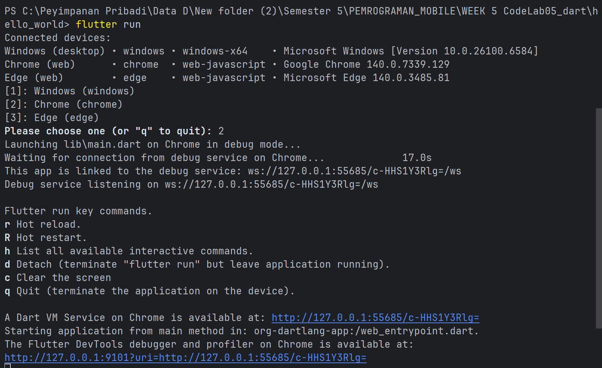
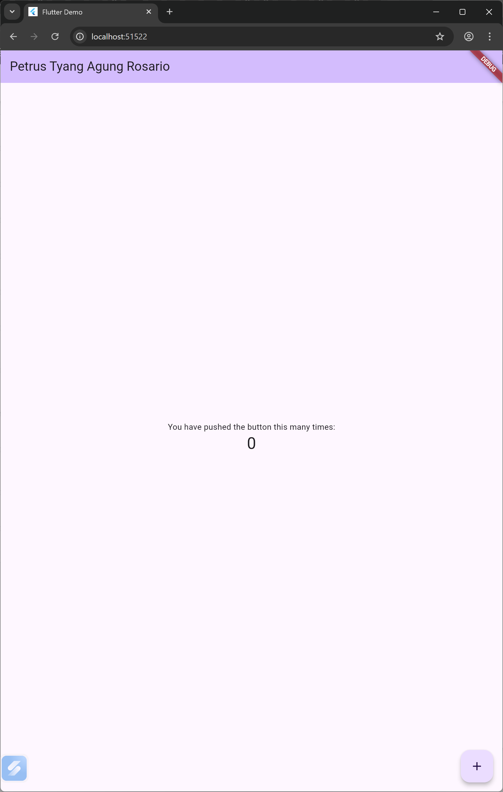
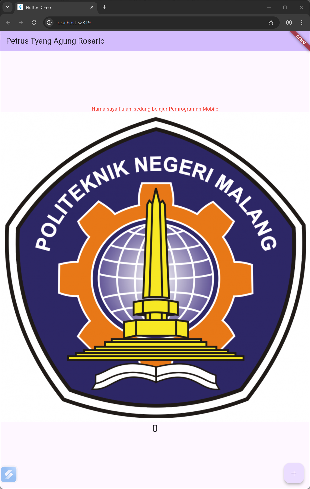
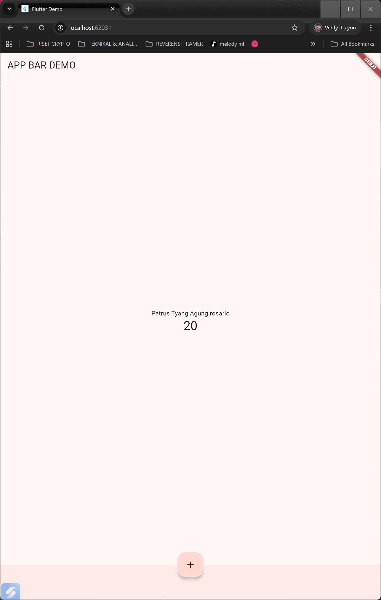
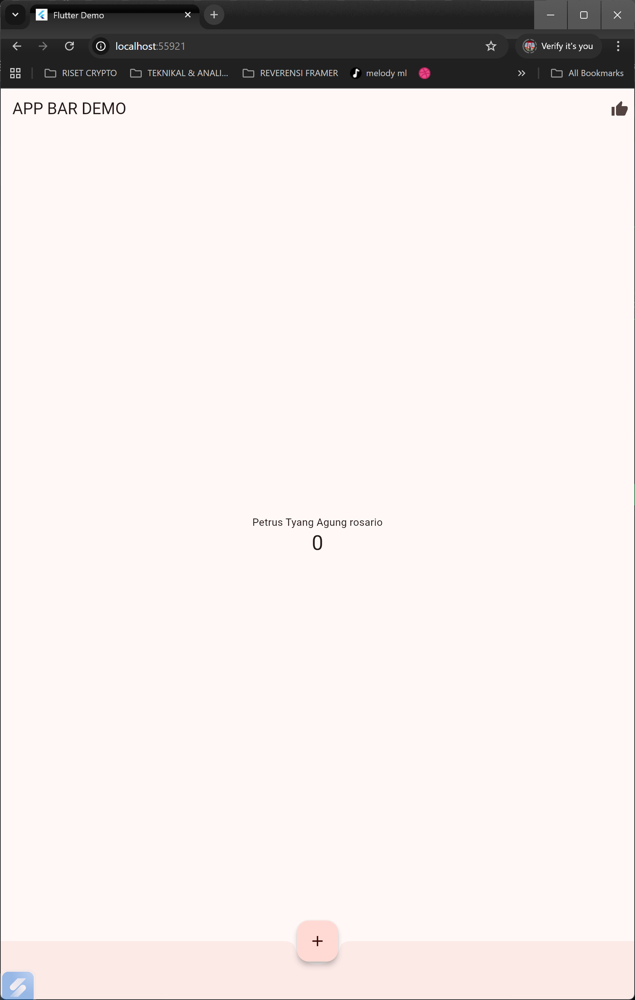

PRAKTIKUM 03

Langkah 11

Langkah 12

PRAKTIKUM 04

Langkah 1: Text Widget

Langkah 2: Image Widget

PRAKTIKUM 05

Langkah 1: Cupertino Button dan Loading Bar

Langkah 2: Floating Action Button (FAB)

Langkah 3: Scaffold Widget

Langkah 4: Dialog Widget

Langkah 5: Input dan Selection Widget

Langkah 6 — Date & Time Pickers

