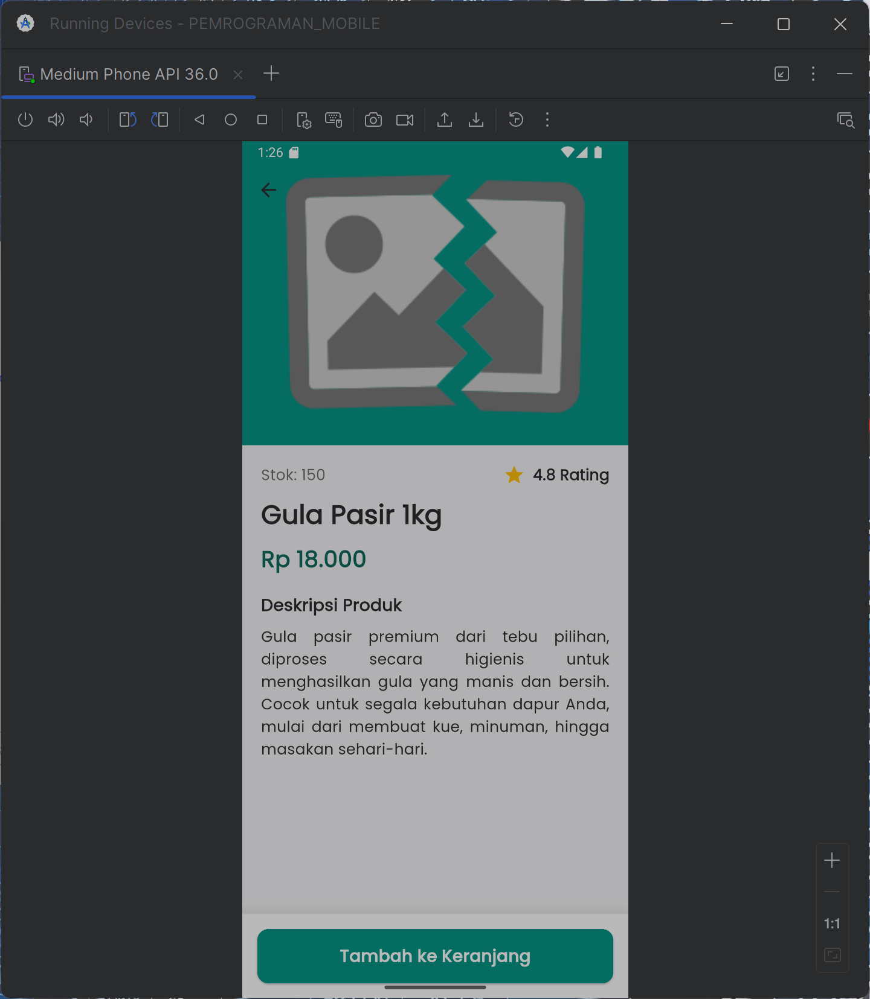

# Membangun Layout di Flutter — README

> **Catatan**: Dokumen ini hanya memperbaiki *layout/formatting* agar lebih rapi dan enak dibaca. **Isi/konten instruksi tetap sama** seperti yang Anda tulis.

---

## Daftar Isi

* [Praktikum 1: Membangun Layout Dasar](#praktikum-1-membangun-layout-dasar)

    * [Langkah 1: Buat Project Baru](#langkah-1-buat-project-baru)
    * [Ganti Kode `lib/main.dart`](#ganti-kode-libmaindart)
    * [Output](#output)
    * [Implementasi *title row*](#implementasi-title-row)
    * [Catatan Soal 1–3](#catatan-soal-13)
* [Praktikum 2: Implementasi Button Row](#praktikum-2-implementasi-button-row)

    * [Langkah 1: Method `Column _buildButtonColumn`](#langkah-1-method-column-_buildbuttoncolumn)
    * [Langkah 2: Widget `buttonSection`](#langkah-2-widget-buttonsection)
    * [Langkah 3: Tambahkan ke `body`](#langkah-3-tambahkan-ke-body)
* [Praktikum 3: Implementasi Text Section](#praktikum-3-implementasi-text-section)

    * [Langkah 1: Widget `textSection`](#langkah-1-widget-textsection)
    * [Langkah 2: Tambahkan ke `body`](#langkah-2-tambahkan-ke-body)
* [Praktikum 4: Implementasi Image Section](#praktikum-4-implementasi-image-section)

    * [Langkah 1: Siapkan Aset Gambar](#langkah-1-siapkan-aset-gambar)
    * [Langkah 2: Tambahkan Gambar ke `body`](#langkah-2-tambahkan-gambar-ke-body)
    * [Langkah 3: Ubah Menjadi `ListView`](#langkah-3-ubah-menjadi-listview)
* [Praktikum 5: Membangun Navigasi di Flutter](#praktikum-5-membangun-navigasi-di-flutter)

    * [Langkah 2: Mendefinisikan Route](#langkah-2-mendefinisikan-route)
    * [Langkah 3: Lengkapi Kode di `main.dart`](#langkah-3-lengkapi-kode-di-maindart)
    * [Langkah 4: Membuat Data Model](#langkah-4-membuat-data-model)
    * [Tugas Praktikum 2](#tugas-praktikum-2)
* [Lampiran / Gambar](#lampiran--gambar)

---

## Praktikum 1: Membangun Layout Dasar

### Langkah 1: Buat Project Baru

Buatlah sebuah project flutter baru dengan nama **`layout_flutter`**. Atau sesuaikan style laporan praktikum yang Anda buat.


### Ganti Kode `lib/main.dart`

Buka file **`lib/main.dart`** lalu ganti dengan kode berikut. **Isi nama dan NIM Anda** di text title.

```dart
import 'package:flutter/material.dart';

void main() => runApp(const MyApp());

class MyApp extends StatelessWidget {
  const MyApp({super.key});

  @override
  Widget build(BuildContext context) {
    return MaterialApp(
      title: 'Flutter layout: Nama dan NIM Anda',
      home: Scaffold(
        appBar: AppBar(
          title: const Text('Flutter layout demo'),
        ),
        body: const Center(
          child: Text('Hello World'),
        ),
      ),
    );
  }
}
```

### Output


### Implementasi *title row*

Pertama, Anda akan membuat kolom bagian kiri pada judul. Tambahkan kode berikut **di bagian atas metode `build()` di dalam kelas `MyApp`**:

```dart
Widget titleSection = Container(
  padding: const EdgeInsets.all(...),
  child: Row(
    children: [
      Expanded(
        /* soal 1*/
        child: Column(
          crossAxisAlignment: ...,
          children: [
            /* soal 2*/
            Container(
              padding: const EdgeInsets.only(bottom: ...),
              child: const Text(
                'Wisata Gunung di Batu',
                style: TextStyle(
                  fontWeight: FontWeight.bold,
                ),
              ),
            ),
            Text(
              'Batu, Malang, Indonesia',
              style: TextStyle(...),
            ),
          ],
        ),
      ),
      /* soal 3*/
      Icon(
        ...,
        color: ...,
      ),
      const Text(...),
    ],
  ),
);
```

Ganti isi **body** text `'Hello World'` dengan variabel `titleSection` seperti berikut:


**Output:**


### Catatan Soal 1–3

* **Soal 1**: Letakkan widget `Column` di dalam widget `Expanded` agar menyesuaikan ruang yang tersisa di dalam widget `Row`. Tambahkan properti `crossAxisAlignment` ke `CrossAxisAlignment.start` sehingga posisi kolom berada di awal baris.
* **Soal 2**: Letakkan baris pertama teks di dalam `Container` sehingga memungkinkan Anda untuk menambahkan `padding = 8`. Teks **‘Batu, Malang, Indonesia'** di dalam `Column`, set warna menjadi abu-abu.
* **Soal 3**: Dua item terakhir di baris judul adalah **ikon bintang** (warna **merah**) dan teks **"41"**. Seluruh baris ada di dalam `Container` dan beri `padding` di sepanjang setiap tepinya sebesar **32 piksel**.

---

## Praktikum 2: Implementasi Button Row

### Langkah 1: Method `Column _buildButtonColumn`

Bagian tombol berisi 3 kolom yang menggunakan tata letak yang sama—sebuah ikon di atas baris teks. Kolom pada baris ini diberi jarak yang sama, dan teks serta ikon diberi **warna primer**. Karena kode untuk membangun setiap kolom hampir sama, buatlah metode pembantu pribadi bernama `buildButtonColumn()`, yang mempunyai parameter **warna**, **Icon** dan **Text**.

**`lib/main.dart` (`_buildButtonColumn`)**

```dart
class MyApp extends StatelessWidget {
  const MyApp({super.key});

  @override
  Widget build(BuildContext context) {
    // ···
  }

  Column _buildButtonColumn(Color color, IconData icon, String label) {
    return Column(
      mainAxisSize: MainAxisSize.min,
      mainAxisAlignment: MainAxisAlignment.center,
      children: [
        Icon(icon, color: color),
        Container(
          margin: const EdgeInsets.only(top: 8),
          child: Text(
            label,
            style: TextStyle(
              fontSize: 12,
              fontWeight: FontWeight.w400,
              color: color,
            ),
          ),
        ),
      ],
    );
  }
}
```

**Output:**


### Langkah 2: Widget `buttonSection`

Buat fungsi untuk menambahkan ikon langsung ke kolom. Teks berada di dalam `Container` dengan **margin di bagian atas**, yang memisahkan teks dari ikon. Bangun baris yang berisi kolom-kolom ini dengan memanggil fungsi dan set **warna**, **Icon**, dan **teks** khusus melalui parameter ke kolom tersebut. Sejajarkan kolom di sepanjang sumbu utama menggunakan `MainAxisAlignment.spaceEvenly`.

Tambahkan kode berikut tepat di bawah deklarasi `titleSection` di dalam metode `build()`:

**`lib/main.dart` (`buttonSection`)**

```dart
Color color = Theme.of(context).primaryColor;

Widget buttonSection = Row(
  mainAxisAlignment: MainAxisAlignment.spaceEvenly,
  children: [
    _buildButtonColumn(color, Icons.call, 'CALL'),
    _buildButtonColumn(color, Icons.near_me, 'ROUTE'),
    _buildButtonColumn(color, Icons.share, 'SHARE'),
  ],
);
```

**Output:**


### Langkah 3: Tambahkan ke `body`

Tambahkan variabel `buttonSection` ke dalam `body` seperti berikut:


**Output:**


---

## Praktikum 3: Implementasi Text Section

### Langkah 1: Widget `textSection`

Tentukan bagian teks sebagai variabel. Masukkan teks ke dalam `Container` dan tambahkan `padding` di sepanjang setiap tepinya. Tambahkan kode berikut tepat di bawah deklarasi `buttonSection`:

```dart
Widget textSection = Container(
  padding: const EdgeInsets.all(32),
  child: const Text(
    'Carilah teks di internet yang sesuai '
    'dengan foto atau tempat wisata yang ingin '
    'Anda tampilkan. '
    'Tambahkan nama dan NIM Anda sebagai '
    'identitas hasil pekerjaan Anda. '
    'Selamat mengerjakan 🙂.',
    softWrap: true,
  ),
);
```

**Output:**


### Langkah 2: Tambahkan ke `body`

Tambahkan widget variabel `textSection` ke dalam `body` seperti berikut:


**Output:**


---

## Praktikum 4: Implementasi Image Section

### Langkah 1: Siapkan Aset Gambar

Anda dapat mencari gambar di internet yang ingin ditampilkan. Buatlah folder **`images`** di **root project `layout_flutter`**. Masukkan file gambar tersebut ke folder `images`, lalu set nama file tersebut ke file `pubspec.yaml` seperti berikut:


**Kode:**

```yaml
flutter:
  assets:
    - assets/images/lake.png
```

### Langkah 2: Tambahkan Gambar ke `body`

Tambahkan aset gambar ke dalam `body` seperti berikut:


**Output:**


### Langkah 3: Ubah Menjadi `ListView`

Pada langkah terakhir ini, atur semua elemen dalam `ListView`, bukan `Column`, karena `ListView` mendukung scroll yang dinamis saat aplikasi dijalankan pada perangkat yang resolusinya lebih kecil.


**Output:**


---

## Praktikum 5: Membangun Navigasi di Flutter

### Langkah 2: Mendefinisikan Route

**`home_page.dart`**

```dart
import 'package:flutter/material.dart';

class HomePage extends StatelessWidget {
  const HomePage({super.key});

  @override
  Widget build(BuildContext context) {
    return Scaffold(
      appBar: AppBar(title: const Text('Home Page')),
      body: Center(
        child: ElevatedButton.icon(
          icon: const Icon(Icons.arrow_forward),
          label: const Text('Go to Item Page'),
          onPressed: () {
            // contoh: kirim argumen opsional
            Navigator.pushNamed(
              context,
              '/item',
              arguments: 'Halo dari HomePage',
            );
          },
        ),
      ),
    );
  }
}
```

**`item_page.dart`**

```dart
import 'package:flutter/material.dart';

class ItemPage extends StatelessWidget {
  const ItemPage({super.key});

  @override
  Widget build(BuildContext context) {
    // terima argumen (jika ada)
    final String? message =
        ModalRoute.of(context)?.settings.arguments as String?;

    return Scaffold(
      appBar: AppBar(title: const Text('Item Page')),
      body: Center(
        child: Text(
          message ?? 'Tidak ada data yang dikirim.',
          style: Theme.of(context).textTheme.titleMedium,
          textAlign: TextAlign.center,
        ),
      ),
    );
  }
}
```

### Langkah 3: Lengkapi Kode di `main.dart`

Setelah kedua halaman telah dibuat dan didefinisikan, bukalah file `main.dart`. Pada langkah ini Anda akan mendefinisikan **Route** untuk kedua halaman tersebut. Definisi penamaan route harus **unik**. Halaman `HomePage` didefinisikan sebagai `/`. Dan halaman `ItemPage` didefinisikan sebagai `/item`. Untuk mendefinisikan halaman awal, Anda dapat menggunakan named argument `initialRoute`. Gambaran tahapan ini dapat Anda lihat pada potongan kode berikut.

```dart
import 'package:flutter/material.dart';
import 'pages/home_page.dart';
import 'pages/item_page.dart';

void main() {
  runApp(
    MaterialApp(
      debugShowCheckedModeBanner: false,
      title: 'Routing Demo',
      // Halaman awal
      initialRoute: '/',
      // Daftar route (nama harus unik)
      routes: {
        '/': (context) => const HomePage(),      // ganti ke HomePage()
        '/item': (context) => const ItemPage(),  // jika constructor tidak const
      },
    ),
  );
}
```

### Langkah 4: Membuat Data Model

Sebelum melakukan perpindahan halaman dari `HomePage` ke `ItemPage`, dibutuhkan proses **pemodelan data**. Pada desain mockup, dibutuhkan dua informasi yaitu **nama** dan **harga**. Untuk menangani hal ini, buatlah sebuah file dengan nama `item.dart` dan letakkan pada folder `models`. Pada file ini didefinisikan pemodelan data yang dibutuhkan. (Ilustrasi kode sesuai kebutuhan Anda.)

---

### Tugas Praktikum 2

1. Untuk melakukan pengiriman data ke halaman berikutnya, cukup menambahkan informasi `arguments` pada penggunaan `Navigator`. Perbarui kode pada bagian `Navigator` menjadi seperti berikut.

   ```dart
   Navigator.pushNamed(context, '/item', arguments: item);
   ```

2. Pembacaan nilai yang dikirimkan pada halaman sebelumnya dapat dilakukan menggunakan `ModalRoute`. Tambahkan kode berikut pada blok fungsi `build` dalam halaman `ItemPage`. Setelah nilai didapatkan, Anda dapat menggunakannya seperti penggunaan variabel pada umumnya. ([https://docs.flutter.dev/cookbook/navigation/navigate-with-arguments](https://docs.flutter.dev/cookbook/navigation/navigate-with-arguments))

   ```dart
   final itemArgs = ModalRoute.of(context)!.settings.arguments as Item;
   ```

3. Pada hasil akhir dari aplikasi belanja yang telah Anda selesaikan, **tambahkan atribut** foto produk, stok, dan rating. **Ubah tampilan menjadi `GridView`** seperti di aplikasi marketplace pada umumnya.

4. Silakan **implementasikan `Hero` widget** pada aplikasi belanja Anda dengan mempelajari dari sumber ini: [https://docs.flutter.dev/cookbook/navigation/hero-animations](https://docs.flutter.dev/cookbook/navigation/hero-animations)

5. Sesuaikan dan modifikasi tampilan sehingga menjadi aplikasi yang menarik. Selain itu, **pecah widget menjadi kode yang lebih kecil**. Tambahkan **Nama dan NIM** di **footer** aplikasi belanja Anda.

6. Selesaikan **Praktikum 5: Navigasi dan Rute** tersebut. Cobalah **modifikasi menggunakan plugin `go_router`**, lalu dokumentasikan dan push ke repository Anda berupa **screenshot setiap hasil pekerjaan** beserta **penjelasannya di file README.md**. Kumpulkan **link commit repository GitHub** Anda kepada dosen yang telah disepakati!

**Back**




---

## Lampiran / Gambar

* Semua gambar dan *screenshot* yang dirujuk sudah terpasang pada path seperti di instruksi asli:

    * `img/img1.png`, `img/img3.png`, `img/img4.png`, `img/img5.png`, `img/img6.png`,
    * `img/img7.png`, `img/img8.png`, `img/img9.png`, `img/img10.png`, `img/img11.png`,
    * `img/img12.png`, `img/img13.png`, `img/img14.png`, `img/img15.png`, `img/img16.png`,
    * `img/img17.png`, `img/img18.png`, `img/img19.png`, `img/img20.png`.

> **Tip**: Pastikan struktur folder gambar sesuai dengan project Anda agar seluruh gambar muncul dengan benar di GitHub/Markdown viewer.
