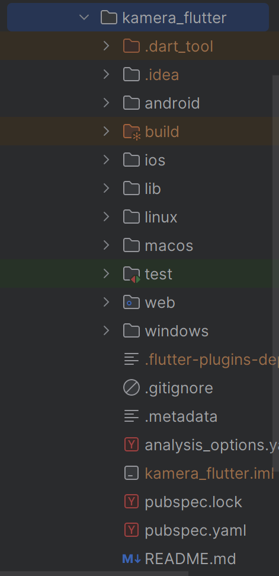
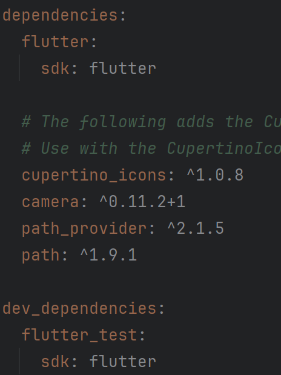
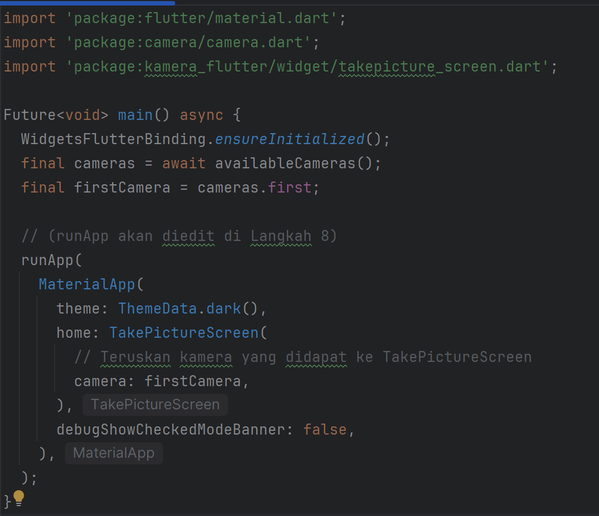
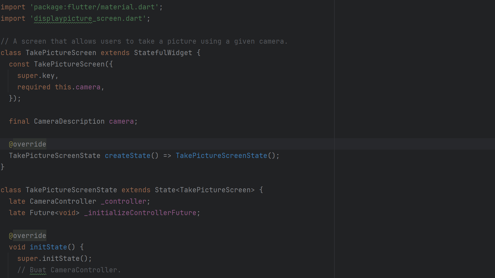
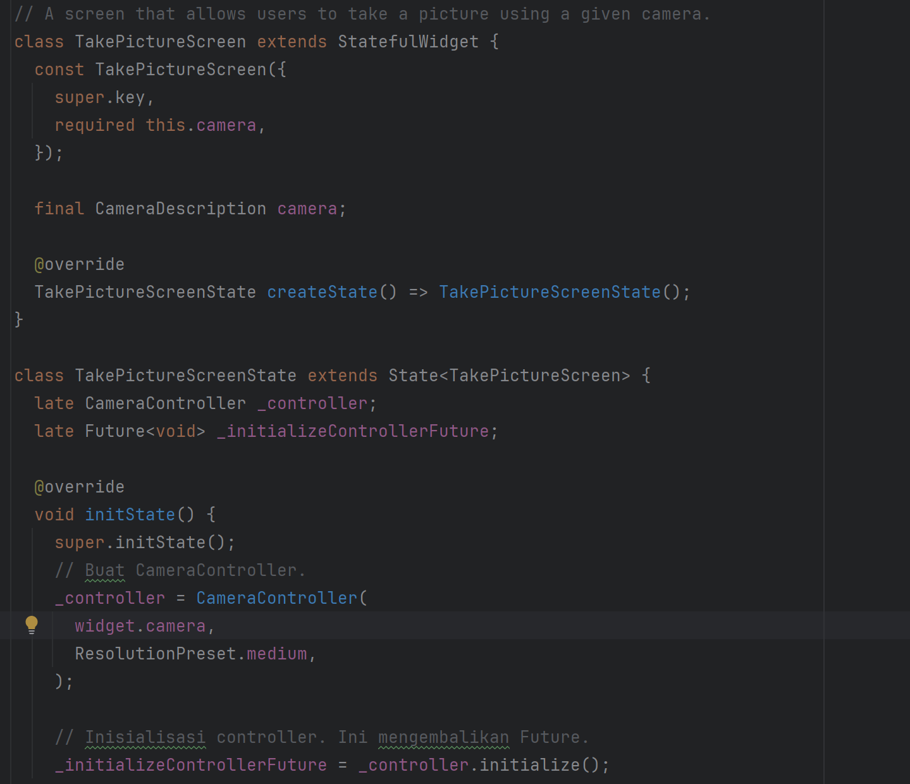

# Praktikum 1: Mengambil Foto dengan Kamera di Flutter

## Langkah 1: Buat Project Baru

Buatlah sebuah project flutter baru dengan nama kamera_flutter, lalu sesuaikan style laporan praktikum yang Anda buat.



## Langkah 2: Tambah dependensi yang diperlukan

Anda memerlukan tiga dependensi pada project flutter untuk menyelesaikan praktikum ini.

camera → menyediakan seperangkat alat untuk bekerja dengan kamera pada device.

path_provider → menyediakan lokasi atau path untuk menyimpan hasil foto.

path → membuat path untuk mendukung berbagai platform.

Untuk menambahkan dependensi plugin, jalankan perintah flutter pub add seperti berikut di terminal:

### flutter pub add camera path_provider path


## Langkah 3: Ambil Sensor Kamera

Selanjutnya, kita perlu mengecek jumlah kamera yang tersedia pada perangkat menggunakan plugin camera seperti pada kode berikut ini. Kode ini letakkan dalam void main().

lib/main.dart

```dart
import 'package:camera/camera.dart';
import 'package:flutter/material.dart';

// Tambahkan variabel global untuk kamera (meskipun nanti akan dilempar ke widget)
// Codelab meminta Anda mengambil 'firstCamera' di sini.

Future<void> main() async {
  // Pastikan plugin terinisialisasi
  WidgetsFlutterBinding.ensureInitialized();

  // Dapatkan daftar kamera
  final cameras = await availableCameras();

  // Ambil kamera pertama (biasanya kamera belakang)
  final firstCamera = cameras.first;

  // (runApp akan diedit di Langkah 8)
  runApp(
    // Placeholder sementara sampai Langkah 8
    MaterialApp(
      home: Scaffold(
        body: Center(
          child: Text('Menunggu Langkah 8...'),
        ),
      ),
    ),
  );
}
```
Output


## Langkah 4: Buat dan inisialisasi CameraController
Setelah Anda dapat mengakses kamera, gunakan langkah-langkah berikut untuk membuat dan menginisialisasi CameraController. Pada langkah berikut ini, Anda akan membuat koneksi ke kamera perangkat yang memungkinkan Anda untuk mengontrol kamera dan menampilkan pratinjau umpan kamera.

Buat StatefulWidget dengan kelas State pendamping.
Tambahkan variabel ke kelas State untuk menyimpan CameraController.
Tambahkan variabel ke kelas State untuk menyimpan Future yang dikembalikan dari CameraController.initialize().
Buat dan inisialisasi controller dalam metode initState().
Hapus controller dalam metode dispose().

lib/widget/takepicture_screen.dart

```dart
import 'package:camera/camera.dart';
import 'package:flutter/material.dart';

// A screen that allows users to take a picture using a given camera.
class TakePictureScreen extends StatefulWidget {
  const TakePictureScreen({
    super.key,
    required this.camera,
  });

  final CameraDescription camera;

  @override
  TakePictureScreenState createState() => TakePictureScreenState();
}

class TakePictureScreenState extends State<TakePictureScreen> {
  late CameraController _controller;
  late Future<void> _initializeControllerFuture;

  @override
  void initState() {
    super.initState();
    // Buat CameraController.
    _controller = CameraController(
      widget.camera,
      ResolutionPreset.medium,
    );

    // Inisialisasi controller. Ini mengembalikan Future.
    _initializeControllerFuture = _controller.initialize();
  }

  @override
  void dispose() {
    // Hapus controller saat widget dibuang.
    _controller.dispose();
    super.dispose();
  }

  @override
  Widget build(BuildContext context) {
    // (Akan diisi di Langkah 5)
    return Container();
  }
}
```
Output


## Langkah 5: Gunakan CameraPreview untuk menampilkan preview foto
Gunakan widget CameraPreview dari package camera untuk menampilkan preview foto. Anda perlu tipe objek void berupa FutureBuilder untuk menangani proses async.

lib/widget/takepicture_screen.dart

```dart
@override
Widget build(BuildContext context) {
  return Scaffold(
    appBar: AppBar(title: const Text('Take a picture - NIM Anda')),
    // Anda harus menunggu controller selesai inisialisasi
    body: FutureBuilder<void>(
      future: _initializeControllerFuture,
      builder: (context, snapshot) {
        if (snapshot.connectionState == ConnectionState.done) {
          // Jika Future selesai, tampilkan preview.
          return CameraPreview(_controller);
        } else {
          // Jika tidak, tampilkan loading indicator.
          return const Center(child: CircularProgressIndicator());
        }
      },
    ),
    // (FloatingActionButton akan ditambahkan di Langkah 6)
  );
}
```
Output


## Langkah 6: Ambil foto dengan CameraController
Anda dapat menggunakan CameraController untuk mengambil gambar menggunakan metode takePicture(), yang mengembalikan objek XFile, merupakan sebuah objek abstraksi File lintas platform yang disederhanakan. Pada Android dan iOS, gambar baru disimpan dalam direktori cache masing-masing, dan path ke lokasi tersebut dikembalikan dalam XFile.

Pada codelab ini, buatlah sebuah FloatingActionButton yang digunakan untuk mengambil gambar menggunakan CameraController saat pengguna mengetuk tombol.

Pengambilan gambar memerlukan 2 langkah:

Pastikan kamera telah diinisialisasi.
Gunakan controller untuk mengambil gambar dan pastikan ia mengembalikan objek Future.
Praktik baik untuk membungkus operasi kode ini dalam blok try / catch guna menangani berbagai kesalahan yang mungkin terjadi.

Kode berikut letakkan dalam Widget build setelah field body.

lib/widget/takepicture_screen.dart

```dart
@override
Widget build(BuildContext context) {
  return Scaffold(
    appBar: AppBar(title: const Text('Take a picture - NIM Anda')),
    body: FutureBuilder<void>(
      // ... (Kode FutureBuilder dari Langkah 5) ...
    ),
    floatingActionButton: FloatingActionButton(
      onPressed: () async {
        // Ambil gambar dalam try/catch block.
        try {
          // Pastikan kamera terinisialisasi.
          await _initializeControllerFuture;

          // Ambil gambar
          final image = await _controller.takePicture();

          // (Logika navigasi akan ditambahkan di Langkah 9)
        } catch (e) {
          // Jika error, log ke console.
          print(e);
        }
      },
      child: const Icon(Icons.camera_alt),
    ),
  );
}
```

Output


## Langkah 7: Buat widget baru DisplayPictureScreen
Buatlah file baru pada folder widget yang berisi kode berikut.

lib/widget/displaypicture_screen.dart

```dart
import 'dart:io';
import 'package:flutter/material.dart';

// Widget untuk menampilkan gambar yang diambil.
class DisplayPictureScreen extends StatelessWidget {
  final String imagePath;

  const DisplayPictureScreen({super.key, required this.imagePath});

  @override
  Widget build(BuildContext context) {
    return Scaffold(
      appBar: AppBar(title: const Text('Display the Picture - NIM Anda')),
      // Gambar disimpan sebagai file di perangkat.
      // Gunakan constructor `Image.file` dengan path yang diberikan.
      body: Image.file(File(imagePath)),
    );
  }
}
```
Output


## Langkah 8: Edit main.dart
Edit pada file ini bagian runApp seperti kode berikut.

lib/main.dart

```dart
// (Import jangan lupa ditambahkan)
import 'package:kamera_flutter/widget/takepicture_screen.dart'; // Sesuaikan path jika perlu

Future<void> main() async {
  WidgetsFlutterBinding.ensureInitialized();
  final cameras = await availableCameras();
  final firstCamera = cameras.first;

  runApp(
    MaterialApp(
      theme: ThemeData.dark(),
      home: TakePictureScreen(
        // Teruskan kamera yang didapat ke TakePictureScreen
        camera: firstCamera,
      ),
      debugShowCheckedModeBanner: false,
    ),
  );
}
```
Output


## Langkah 9: Menampilkan hasil foto
Tambahkan kode seperti berikut pada bagian try / catch agar dapat menampilkan hasil foto pada DisplayPictureScreen.

lib/widget/takepicture_screen.dart

```dart
// (Import jangan lupa ditambahkan)
import 'package:kamera_flutter/widget/displaypicture_screen.dart'; // Sesuaikan path

// ... (di dalam TakePictureScreenState) ...

floatingActionButton: FloatingActionButton(
  onPressed: () async {
    try {
      await _initializeControllerFuture;
      final image = await _controller.takePicture();

      if (!context.mounted) return;

      // Jika gambar diambil, tampilkan di layar baru.
      await Navigator.of(context).push(
        MaterialPageRoute(
          builder: (context) => DisplayPictureScreen(
            imagePath: image.path,
          ),
        ),
      );
    } catch (e) {
      print(e);
    }
  },
  child: const Icon(Icons.camera_alt),
),
```
Output


Hasil


# Praktikum 2: Membuat photo filter carousel
Semua orang tahu bahwa foto akan terlihat lebih bagus dengan filter. Pada codelab ini, Anda akan membuat rangkaian pilihan filter yang dapat digeser sesuai pilihan warna.

Berikut ini menunjukkan aplikasi yang akan Anda buat:

Selesaikan langkah-langkah praktikum berikut ini.

## Langkah 1: Buat project baru

Buatlah project flutter baru di pertemuan 09 dengan nama photo_filter_carousel


## Langkah 2: Buat widget Selector ring dan dark gradient
Buatlah folder widget dan file baru yang berisi kode berikut.

lib/widget/filter_selector.dart

```dart
// (Tambahkan import di bagian atas - lihat bagian Troubleshoot di akhir)
import 'dart:math' as math;
import 'package.flutter/material.dart';
import 'package.flutter/rendering.dart' show ViewportOffset;
import 'package:photo_filter_carousel/widget/carousel_flowdelegate.dart'; // (Akan dibuat di Langkah 4)
import 'package:photo_filter_carousel/widget/filter_item.dart'; // (Akan dibuat di Langkah 5)

@immutable
class FilterSelector extends StatefulWidget {
  const FilterSelector({
    super.key,
    required this.filters,
    required this.onFilterChanged,
    this.padding = const EdgeInsets.symmetric(vertical: 24),
  });

  final List<Color> filters;
  final void Function(Color selectedColor) onFilterChanged;
  final EdgeInsets padding;

  @override
  State<FilterSelector> createState() => _FilterSelectorState();
}

class _FilterSelectorState extends State<FilterSelector> {
  static const _filtersPerScreen = 5;
  static const _viewportFractionPerItem = 1.0 / _filtersPerScreen;

  late final PageController _controller;
  late int _page;

  int get filterCount => widget.filters.length;

  Color itemColor(int index) => widget.filters[index % filterCount];

  @override
  void initState() {
    super.initState();
    _page = 0;
    _controller = PageController(
      initialPage: _page,
      viewportFraction: _viewportFractionPerItem,
    );
    _controller.addListener(_onPageChanged);
  }

  void _onPageChanged() {
    final page = (_controller.page ?? 0).round();
    if (page != _page) {
      _page = page;
      widget.onFilterChanged(widget.filters[page]);
    }
  }

  void _onFilterTapped(int index) {
    _controller.animateToPage(
      index,
      duration: const Duration(milliseconds: 450),
      curve: Curves.ease,
    );
  }

  @override
  void dispose() {
    _controller.dispose();
    super.dispose();
  }

  @override
  Widget build(BuildContext context) {
    return Scrollable(
      controller: _controller,
      axisDirection: AxisDirection.right,
      physics: const PageScrollPhysics(),
      viewportBuilder: (context, viewportOffset) {
        return LayoutBuilder(
          builder: (context, constraints) {
            final itemSize = constraints.maxWidth * _viewportFractionPerItem;
            viewportOffset
              ..applyViewportDimension(constraints.maxWidth)
              ..applyContentDimensions(0.0, itemSize * (filterCount - 1));

            return Stack(
              alignment: Alignment.bottomCenter,
              children: [
                _buildShadowGradient(itemSize),
                _buildCarousel(
                  viewportOffset: viewportOffset,
                  itemSize: itemSize,
                ),
                _buildSelectionRing(itemSize),
              ],
            );
          },
        );
      },
    );
  }

  Widget _buildShadowGradient(double itemSize) {
    return SizedBox(
      height: itemSize * 2 + widget.padding.vertical,
      child: const DecoratedBox(
        decoration: BoxDecoration(
          gradient: LinearGradient(
            begin: Alignment.topCenter,
            end: Alignment.bottomCenter,
            colors: [
              Colors.transparent,
              Colors.black,
            ],
          ),
        ),
        child: SizedBox.expand(),
      ),
    );
  }

  Widget _buildCarousel({
    required ViewportOffset viewportOffset,
    required double itemSize,
  }) {
    return Container(
      height: itemSize,
      margin: widget.padding,
      child: Flow(
        delegate: CarouselFlowDelegate(
          viewportOffset: viewportOffset,
          filtersPerScreen: _filtersPerScreen,
        ),
        children: [
          for (int i = 0; i < filterCount; i++)
            FilterItem(
              onFilterSelected: () => _onFilterTapped(i),
              color: itemColor(i),
            ),
        ],
      ),
    );
  }

  Widget _buildSelectionRing(double itemSize) {
    return IgnorePointer(
      child: Padding(
        padding: widget.padding,
        child: SizedBox(
          width: itemSize,
          height: itemSize,
          child: const DecoratedBox(
            decoration: BoxDecoration(
              shape: BoxShape.circle,
              border: Border.fromBorderSide(
                BorderSide(width: 6, color: Colors.white),
              ),
            ),
          ),
        ),
      ),
    );
  }
}
```
Output

Langkah 3: Buat widget photo filter carousel
Buat file baru di folder widget dengan kode seperti berikut.

lib/widget/filter_carousel.dart
```dart
import 'package:flutter/material.dart';
import 'package:photo_filter_carousel/widget/filter_selector.dart'; // (Dari Langkah 2)

@immutable
class PhotoFilterCarousel extends StatefulWidget {
  const PhotoFilterCarousel({super.key});

  @override
  State<PhotoFilterCarousel> createState() => _PhotoFilterCarouselState();
}

class _PhotoFilterCarouselState extends State<PhotoFilterCarousel> {
  final _filters = [
    Colors.white,
    ...List.generate(
      Colors.primaries.length,
      (index) => Colors.primaries[(index * 4) % Colors.primaries.length],
    ),
  ];

  final _filterColor = ValueNotifier<Color>(Colors.white);

  void _onFilterChanged(Color value) {
    _filterColor.value = value;
  }

  @override
  Widget build(BuildContext context) {
    return Material(
      color: Colors.black,
      child: Stack(
        children: [
          Positioned.fill(child: _buildPhotoWithFilter()),
          Positioned(
            left: 0.0,
            right: 0.0,
            bottom: 0.0,
            child: _buildFilterSelector(),
          ),
        ],
      ),
    );
  }

  Widget _buildPhotoWithFilter() {
    return ValueListenableBuilder(
      valueListenable: _filterColor,
      builder: (context, color, child) {
        // Anda bisa ganti dengan foto Anda sendiri
        return Image.network(
          'https://picsum.photos/800/1200',
          color: color.withOpacity(0.5),
          colorBlendMode: BlendMode.color,
          fit: BoxFit.cover,
          errorBuilder: (context, error, stackTrace) {
            return Container(
              color: Colors.grey,
              child: const Center(
                child: Icon(Icons.error, color: Colors.white, size: 64),
              ),
            );
          },
        );
      },
    );
  }

  Widget _buildFilterSelector() {
    return FilterSelector(onFilterChanged: _onFilterChanged, filters: _filters);
  }
}
```

Output


## Langkah 4: Membuat filter warna - bagian 1
Buat file baru di folder widget seperti kode berikut.

lib/widget/carousel_flowdelegate.dart
```dart
class CarouselFlowDelegate extends FlowDelegate {
  CarouselFlowDelegate({
    required this.viewportOffset,
    required this.filtersPerScreen,
  }) : super(repaint: viewportOffset);

  final ViewportOffset viewportOffset;
  final int filtersPerScreen;

  @override
  void paintChildren(FlowPaintingContext context) {
    final count = context.childCount;

    // All available painting width
    final size = context.size.width;

    // The distance that a single item "page" takes up from the perspective
    // of the scroll paging system. We also use this size for the width and
    // height of a single item.
    final itemExtent = size / filtersPerScreen;

    // The current scroll position expressed as an item fraction, e.g., 0.0,
    // or 1.0, or 1.3, or 2.9, etc. A value of 1.3 indicates that item at
    // index 1 is active, and the user has scrolled 30% towards the item at
    // index 2.
    final active = viewportOffset.pixels / itemExtent;

    // Index of the first item we need to paint at this moment.
    // At most, we paint 3 items to the left of the active item.
    final min = math.max(0, active.floor() - 3).toInt();

    // Index of the last item we need to paint at this moment.
    // At most, we paint 3 items to the right of the active item.
    final max = math.min(count - 1, active.ceil() + 3).toInt();

    // Generate transforms for the visible items and sort by distance.
    for (var index = min; index <= max; index++) {
      final itemXFromCenter = itemExtent * index - viewportOffset.pixels;
      final percentFromCenter = 1.0 - (itemXFromCenter / (size / 2)).abs();
      final itemScale = 0.5 + (percentFromCenter * 0.5);
      final opacity = 0.25 + (percentFromCenter * 0.75);

      final itemTransform = Matrix4.identity()
        ..translate((size - itemExtent) / 2)
        ..translate(itemXFromCenter)
        ..translate(itemExtent / 2, itemExtent / 2)
        ..multiply(Matrix4.diagonal3Values(itemScale, itemScale, 1.0))
        ..translate(-itemExtent / 2, -itemExtent / 2);

      context.paintChild(
        index,
        transform: itemTransform,
        opacity: opacity,
      );
    }
  }

  @override
  bool shouldRepaint(covariant CarouselFlowDelegate oldDelegate) {
    return oldDelegate.viewportOffset != viewportOffset;
  }
}
```

Output


Langkah 5: Membuat filter warna
Buat file baru di folder widget seperti kode berikut ini.

lib/widget/filter_item.dart
```dart
import 'package:flutter/material.dart';

@immutable
class FilterItem extends StatelessWidget {
  const FilterItem({super.key, required this.color, this.onFilterSelected});

  final Color color;
  final VoidCallback? onFilterSelected;

  @override
  Widget build(BuildContext context) {
    return GestureDetector(
      onTap: onFilterSelected,
      child: AspectRatio(
        aspectRatio: 1.0,
        child: Padding(
          padding: const EdgeInsets.all(8),
          child: ClipOval(
            child: Image.network(
              'https://picsum.photos/200',
              color: color.withOpacity(0.5),
              colorBlendMode: BlendMode.hardLight,
              fit: BoxFit.cover,
              errorBuilder: (context, error, stackTrace) {
                return Container(
                  color: Colors.grey,
                  child: const Icon(Icons.error, color: Colors.white),
                );
              },
            ),
          ),
        ),
      ),
    );
  }
}
```

Output


Langkah 6: Implementasi filter carousel
Terakhir, kita impor widget PhotoFilterCarousel ke main seperti kode berikut ini.

lib/main.dart
```dart
import 'package:flutter/material.dart';
import 'package:photo_filter_carousel/widget/filter_carousel.dart';

void main() {
  runApp(
    const MaterialApp(
      home: PhotoFilterCarousel(),
      debugShowCheckedModeBanner: false,
    ),
  );
}
```
Output


# Menerapkan Kamera dan Filter
1. Membuat projek baru dengan nama kamera_filter_app
2. Menambahkan dependensi kamera

    ```bash
    flutter pub add camera path_provider path
    ```
3. Merubah versi minSDK menjadi 21 pada file android/app/build.gradle.kts


4. Membuat struktur folder


5. Buat file lib/widgets/carousel_flowdelegate.dart dan isi dengan kode berikut:

```dart
// (Tambahkan import di bagian atas - lihat bagian Troubleshoot di akhir)
import 'dart:math' as math;
import 'package:flutter/material.dart';
import 'package:flutter/rendering.dart' show ViewportOffset;

class CarouselFlowDelegate extends FlowDelegate {
  CarouselFlowDelegate({
    required this.viewportOffset,
    required this.filtersPerScreen,
  }) : super(repaint: viewportOffset);

  final ViewportOffset viewportOffset;
  final int filtersPerScreen;

  @override
  void paintChildren(FlowPaintingContext context) {
    final count = context.childCount;

    // All available painting width
    final size = context.size.width;

    // The distance that a single item "page" takes up from the perspective
    // of the scroll paging system. We also use this size for the width and
    // height of a single item.
    final itemExtent = size / filtersPerScreen;

    // The current scroll position expressed as an item fraction, e.g., 0.0,
    // or 1.0, or 1.3, or 2.9, etc. A value of 1.3 indicates that item at
    // index 1 is active, and the user has scrolled 30% towards the item at
    // index 2.
    final active = viewportOffset.pixels / itemExtent;

    // Index of the first item we need to paint at this moment.
    // At most, we paint 3 items to the left of the active item.
    final min = math.max(0, active.floor() - 3).toInt();

    // Index of the last item we need to paint at this moment.
    // At most, we paint 3 items to the right of the active item.
    final max = math.min(count - 1, active.ceil() + 3).toInt();

    // Generate transforms for the visible items and sort by distance.
    for (var index = min; index <= max; index++) {
      final itemXFromCenter = itemExtent * index - viewportOffset.pixels;
      final percentFromCenter = 1.0 - (itemXFromCenter / (size / 2)).abs();
      final itemScale = 0.5 + (percentFromCenter * 0.5);
      final opacity = 0.25 + (percentFromCenter * 0.75);

      final itemTransform = Matrix4.identity()
        ..translate((size - itemExtent) / 2)
        ..translate(itemXFromCenter)
        ..translate(itemExtent / 2, itemExtent / 2)
        ..multiply(Matrix4.diagonal3Values(itemScale, itemScale, 1.0))
        ..translate(-itemExtent / 2, -itemExtent / 2);

      context.paintChild(
        index,
        transform: itemTransform,
        opacity: opacity,
      );
    }
  }

  @override
  bool shouldRepaint(covariant CarouselFlowDelegate oldDelegate) {
    return oldDelegate.viewportOffset != viewportOffset;
  }
}
```

6. Buat file lib/widgets/filter_item.dart dan isi dengan kode berikut:
```dart
import 'package:flutter/material.dart';

@immutable
class FilterItem extends StatelessWidget {
  const FilterItem({super.key, required this.color, this.onFilterSelected});

  final Color color;
  final VoidCallback? onFilterSelected;

  @override
  Widget build(BuildContext context) {
    return GestureDetector(
      onTap: onFilterSelected,
      child: AspectRatio(
        aspectRatio: 1.0,
        child: Padding(
          padding: const EdgeInsets.all(8),
          child: ClipOval(
            child: Image.network(
              'https://picsum.photos/200',
              color: color.withOpacity(0.5),
              colorBlendMode: BlendMode.hardLight,
              fit: BoxFit.cover,
              errorBuilder: (context, error, stackTrace) {
                return Container(
                  color: Colors.grey,
                  child: const Icon(Icons.error, color: Colors.white),
                );
              },
            ),
          ),
        ),
      ),
    );
  }
}
```

7. Buat file lib/widgets/filter_selector.dart dan isi dengan kode berikut:
```dart
// (Tambahkan import di bagian atas - lihat bagian Troubleshoot di akhir)
import 'dart:math' as math;
import 'package:flutter/material.dart';
import 'package:flutter/rendering.dart' show ViewportOffset;
import 'package:kamera_filter_app/widgets/carousel_flowdelegate.dart';
import 'package:kamera_filter_app/widgets/filter_item.dart';

@immutable
class FilterSelector extends StatefulWidget {
  const FilterSelector({
    super.key,
    required this.filters,
    required this.onFilterChanged,
    this.padding = const EdgeInsets.symmetric(vertical: 24),
  });

  final List<Color> filters;
  final void Function(Color selectedColor) onFilterChanged;
  final EdgeInsets padding;

  @override
  State<FilterSelector> createState() => _FilterSelectorState();
}

class _FilterSelectorState extends State<FilterSelector> {
  static const _filtersPerScreen = 5;
  static const _viewportFractionPerItem = 1.0 / _filtersPerScreen;

  late final PageController _controller;
  late int _page;

  int get filterCount => widget.filters.length;

  Color itemColor(int index) => widget.filters[index % filterCount];

  @override
  void initState() {
    super.initState();
    _page = 0;
    _controller = PageController(
      initialPage: _page,
      viewportFraction: _viewportFractionPerItem,
    );
    _controller.addListener(_onPageChanged);
  }

  void _onPageChanged() {
    final page = (_controller.page ?? 0).round();
    if (page != _page) {
      _page = page;
      widget.onFilterChanged(widget.filters[page]);
    }
  }

  void _onFilterTapped(int index) {
    _controller.animateToPage(
      index,
      duration: const Duration(milliseconds: 450),
      curve: Curves.ease,
    );
  }

  @override
  void dispose() {
    _controller.dispose();
    super.dispose();
  }

  @override
  Widget build(BuildContext context) {
    return Scrollable(
      controller: _controller,
      axisDirection: AxisDirection.right,
      physics: const PageScrollPhysics(),
      viewportBuilder: (context, viewportOffset) {
        return LayoutBuilder(
          builder: (context, constraints) {
            final itemSize = constraints.maxWidth * _viewportFractionPerItem;
            viewportOffset
              ..applyViewportDimension(constraints.maxWidth)
              ..applyContentDimensions(0.0, itemSize * (filterCount - 1));

            return Stack(
              alignment: Alignment.bottomCenter,
              children: [
                _buildShadowGradient(itemSize),
                _buildCarousel(
                  viewportOffset: viewportOffset,
                  itemSize: itemSize,
                ),
                _buildSelectionRing(itemSize),
              ],
            );
          },
        );
      },
    );
  }

  Widget _buildShadowGradient(double itemSize) {
    return SizedBox(
      height: itemSize * 2 + widget.padding.vertical,
      child: const DecoratedBox(
        decoration: BoxDecoration(
          gradient: LinearGradient(
            begin: Alignment.topCenter,
            end: Alignment.bottomCenter,
            colors: [
              Colors.transparent,
              Colors.black,
            ],
          ),
        ),
        child: SizedBox.expand(),
      ),
    );
  }

  Widget _buildCarousel({
    required ViewportOffset viewportOffset,
    required double itemSize,
  }) {
    return Container(
      height: itemSize,
      margin: widget.padding,
      child: Flow(
        delegate: CarouselFlowDelegate(
          viewportOffset: viewportOffset,
          filtersPerScreen: _filtersPerScreen,
        ),
        children: [
          for (int i = 0; i < filterCount; i++)
            FilterItem(
              onFilterSelected: () => _onFilterTapped(i),
              color: itemColor(i),
            ),
        ],
      ),
    );
  }

  Widget _buildSelectionRing(double itemSize) {
    return IgnorePointer(
      child: Padding(
        padding: widget.padding,
        child: SizedBox(
          width: itemSize,
          height: itemSize,
          child: const DecoratedBox(
            decoration: BoxDecoration(
              shape: BoxShape.circle,
              border: Border.fromBorderSide(
                BorderSide(width: 6, color: Colors.white),
              ),
            ),
          ),
        ),
      ),
    );
  }
}
```

8. Perbarui kode lib/main.dart dengan kode berikut:
```dart
import 'package:flutter/material.dart';
import 'package:camera/camera.dart';
import 'package:kamera_filter_app/screens/take_picture_screen.dart';

Future<void> main() async {
  // Pastikan plugin terinisialisasi
  WidgetsFlutterBinding.ensureInitialized();

  // Dapatkan daftar kamera
  final cameras = await availableCameras();

  // Ambil kamera pertama (biasanya kamera belakang)
  final firstCamera = cameras.first;

  // (runApp akan diedit di Langkah 8)
  runApp(
    MaterialApp(
      theme: ThemeData.dark(),
      home: TakePictureScreen(
        // Teruskan kamera yang didapat ke TakePictureScreen
        camera: firstCamera,
      ),
      debugShowCheckedModeBanner: false,
    ),
  );
}

class MyApp extends StatelessWidget {
  const MyApp({super.key});

  // This widget is the root of your application.
  @override
  Widget build(BuildContext context) {
    return MaterialApp(
      title: 'Flutter Demo',
      theme: ThemeData(
        // This is the theme of your application.
        //
        // TRY THIS: Try running your application with "flutter run". You'll see
        // the application has a purple toolbar. Then, without quitting the app,
        // try changing the seedColor in the colorScheme below to Colors.green
        // and then invoke "hot reload" (save your changes or press the "hot
        // reload" button in a Flutter-supported IDE, or press "r" if you used
        // the command line to start the app).
        //
        // Notice that the counter didn't reset back to zero; the application
        // state is not lost during the reload. To reset the state, use hot
        // restart instead.
        //
        // This works for code too, not just values: Most code changes can be
        // tested with just a hot reload.
        colorScheme: ColorScheme.fromSeed(seedColor: Colors.deepPurple),
      ),
      home: const MyHomePage(title: 'Flutter Demo Home Page'),
    );
  }
}

class MyHomePage extends StatefulWidget {
  const MyHomePage({super.key, required this.title});

  // This widget is the home page of your application. It is stateful, meaning
  // that it has a State object (defined below) that contains fields that affect
  // how it looks.

  // This class is the configuration for the state. It holds the values (in this
  // case the title) provided by the parent (in this case the App widget) and
  // used by the build method of the State. Fields in a Widget subclass are
  // always marked "final".

  final String title;

  @override
  State<MyHomePage> createState() => _MyHomePageState();
}

class _MyHomePageState extends State<MyHomePage> {
  int _counter = 0;

  void _incrementCounter() {
    setState(() {
      // This call to setState tells the Flutter framework that something has
      // changed in this State, which causes it to rerun the build method below
      // so that the display can reflect the updated values. If we changed
      // _counter without calling setState(), then the build method would not be
      // called again, and so nothing would appear to happen.
      _counter++;
    });
  }

  @override
  Widget build(BuildContext context) {
    // This method is rerun every time setState is called, for instance as done
    // by the _incrementCounter method above.
    //
    // The Flutter framework has been optimized to make rerunning build methods
    // fast, so that you can just rebuild anything that needs updating rather
    // than having to individually change instances of widgets.
    return Scaffold(
      appBar: AppBar(
        // TRY THIS: Try changing the color here to a specific color (to
        // Colors.amber, perhaps?) and trigger a hot reload to see the AppBar
        // change color while the other colors stay the same.
        backgroundColor: Theme.of(context).colorScheme.inversePrimary,
        // Here we take the value from the MyHomePage object that was created by
        // the App.build method, and use it to set our appbar title.
        title: Text(widget.title),
      ),
      body: Center(
        // Center is a layout widget. It takes a single child and positions it
        // in the middle of the parent.
        child: Column(
          // Column is also a layout widget. It takes a list of children and
          // arranges them vertically. By default, it sizes itself to fit its
          // children horizontally, and tries to be as tall as its parent.
          //
          // Column has various properties to control how it sizes itself and
          // how it positions its children. Here we use mainAxisAlignment to
          // center the children vertically; the main axis here is the vertical
          // axis because Columns are vertical (the cross axis would be
          // horizontal).
          //
          // TRY THIS: Invoke "debug painting" (choose the "Toggle Debug Paint"
          // action in the IDE, or press "p" in the console), to see the
          // wireframe for each widget.
          mainAxisAlignment: MainAxisAlignment.center,
          children: <Widget>[
            const Text('You have pushed the button this many times:'),
            Text(
              '$_counter',
              style: Theme.of(context).textTheme.headlineMedium,
            ),
          ],
        ),
      ),
      floatingActionButton: FloatingActionButton(
        onPressed: _incrementCounter,
        tooltip: 'Increment',
        child: const Icon(Icons.add),
      ), // This trailing comma makes auto-formatting nicer for build methods.
    );
  }
}
```

9. Buat file baru di lib/screens/takepicture_screen.dart
```dart
import 'package:camera/camera.dart';
import 'package:flutter/material.dart';
import 'package:kamera_filter_app/screens/filter_screen.dart';

// A screen that allows users to take a picture using a given camera.
class TakePictureScreen extends StatefulWidget {
  const TakePictureScreen({
    super.key,
    required this.camera,
  });

  final CameraDescription camera;

  @override
  TakePictureScreenState createState() => TakePictureScreenState();
}

class TakePictureScreenState extends State<TakePictureScreen> {
  late CameraController _controller;
  late Future<void> _initializeControllerFuture;

  @override
  void initState() {
    super.initState();
    // Buat CameraController.
    _controller = CameraController(
      widget.camera,
      ResolutionPreset.medium,
    );

    // Inisialisasi controller. Ini mengembalikan Future.
    _initializeControllerFuture = _controller.initialize();
  }

  @override
  void dispose() {
    // Hapus controller saat widget dibuang.
    _controller.dispose();
    super.dispose();
  }

  @override
  Widget build(BuildContext context) {
    return Scaffold(
      appBar: AppBar(title: const Text('Take a picture - 2341720028')),
      // Anda harus menunggu controller selesai inisialisasi
      body: FutureBuilder<void>(
        future: _initializeControllerFuture,
        builder: (context, snapshot) {
          if (snapshot.connectionState == ConnectionState.done) {
            // Jika Future selesai, tampilkan preview.
            return CameraPreview(_controller);
          } else {
            // Jika tidak, tampilkan loading indicator.
            return const Center(child: CircularProgressIndicator());
          }
        },
      ),
      floatingActionButton: FloatingActionButton(
        onPressed: () async {
          try {
            await _initializeControllerFuture;
            final image = await _controller.takePicture();

            if (!context.mounted) return;

            // Jika gambar diambil, tampilkan di layar baru.
            await Navigator.of(context).push(
              MaterialPageRoute(
                builder: (context) => FilterScreen(
                  imagePath: image.path,
                ),
              ),
            );
          } catch (e) {
            print(e);
          }
        },
        child: const Icon(Icons.camera_alt),
      ),
    );
  }
}
```
10. Buat file lib/screens/filter_screen.dart dan isi kode berikut:
```dart
import 'dart:io'; // Penting untuk Image.file
import 'package:flutter/material.dart';
import 'package:kamera_filter_app/widgets/filter_selector.dart';

// Ini adalah gabungan dari DisplayPictureScreen (P1) dan PhotoFilterCarousel (P2)
class FilterScreen extends StatefulWidget {
  final String imagePath; // Diambil dari P1

  const FilterScreen({super.key, required this.imagePath});

  @override
  State<FilterScreen> createState() => _FilterScreenState();
}

class _FilterScreenState extends State<FilterScreen> {
  // Logic state management diambil dari P2 (PhotoFilterCarousel)
  final _filters = [
    Colors.white,
    ...List.generate(
      Colors.primaries.length,
          (index) => Colors.primaries[(index * 4) % Colors.primaries.length],
    ),
  ];

  final _filterColor = ValueNotifier<Color>(Colors.white);

  void _onFilterChanged(Color value) {
    _filterColor.value = value;
  }

  // Build method diambil dari P2 (PhotoFilterCarousel)
  @override
  Widget build(BuildContext context) {
    return Scaffold(
      appBar: AppBar(title: const Text('Apply Filter - 2341720028')),
      body: Material(
        color: Colors.black,
        child: Stack(
          children: [
            Positioned.fill(
              // Panggil method _buildPhotoWithFilter
              child: _buildPhotoWithFilter(),
            ),
            Positioned(
              left: 0.0,
              right: 0.0,
              bottom: 0.0,
              // Panggil method _buildFilterSelector
              child: _buildFilterSelector(),
            ),
          ],
        ),
      ),
    );
  }

  // Method ini diambil dari P2, TAPI...
  Widget _buildPhotoWithFilter() {
    return ValueListenableBuilder(
      valueListenable: _filterColor,
      builder: (context, color, child) {
        // ...Kita GANTI Image.network() dengan Image.file() dari P1
        return Image.file(
          File(widget.imagePath), // <-- PERUBAHAN UTAMA
          color: color.withOpacity(0.5),
          colorBlendMode: BlendMode.color,
          fit: BoxFit.cover,
        );
      },
    );
  }

  // Method ini diambil dari P2
  Widget _buildFilterSelector() {
    return FilterSelector(
      onFilterChanged: _onFilterChanged,
      filters: _filters,
    );
  }
}
```