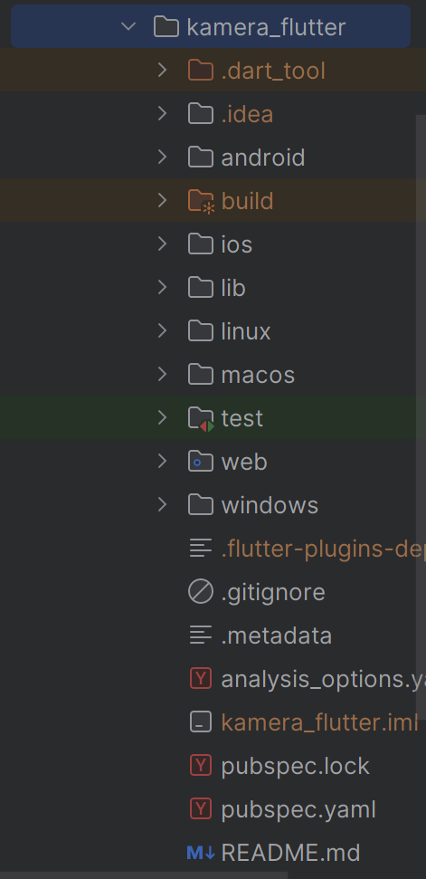
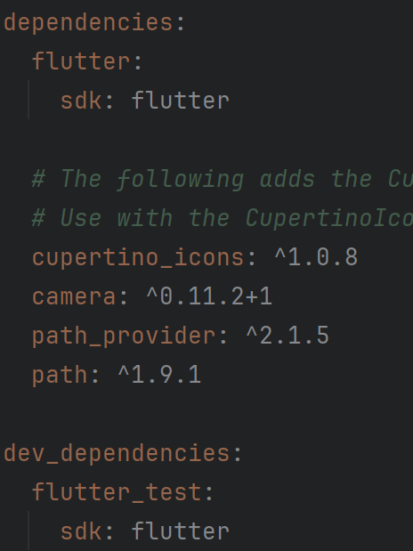
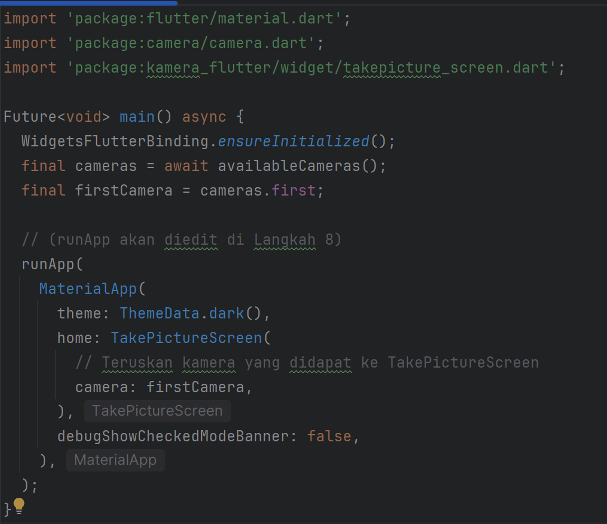
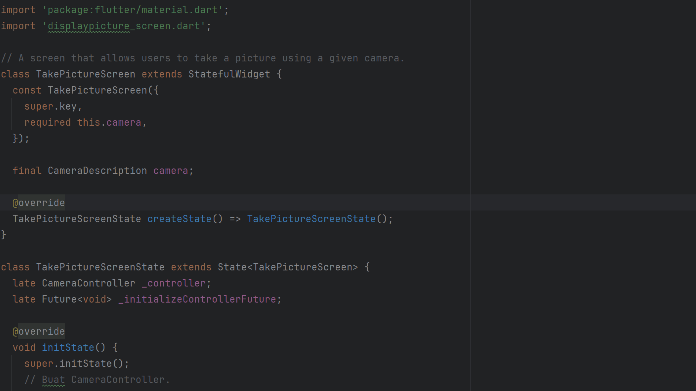
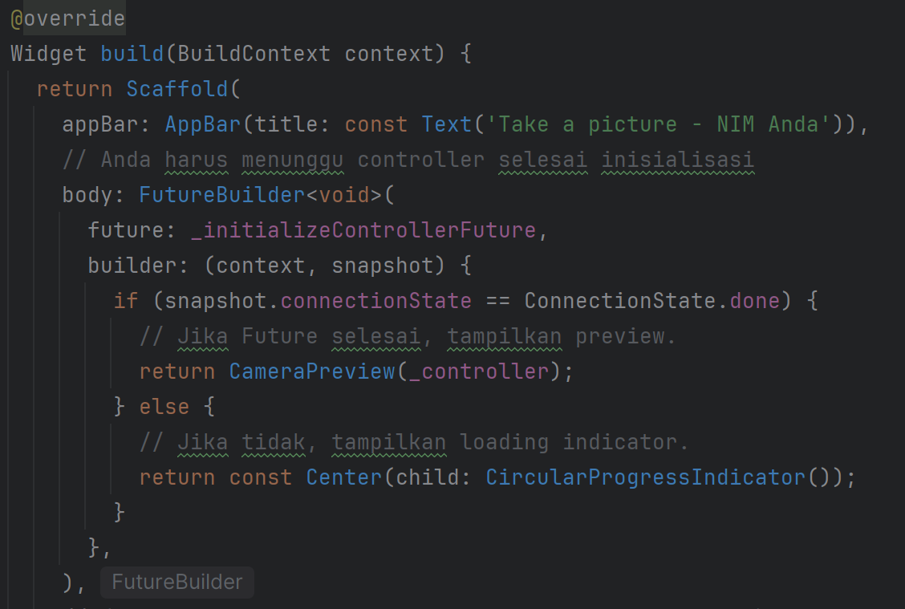
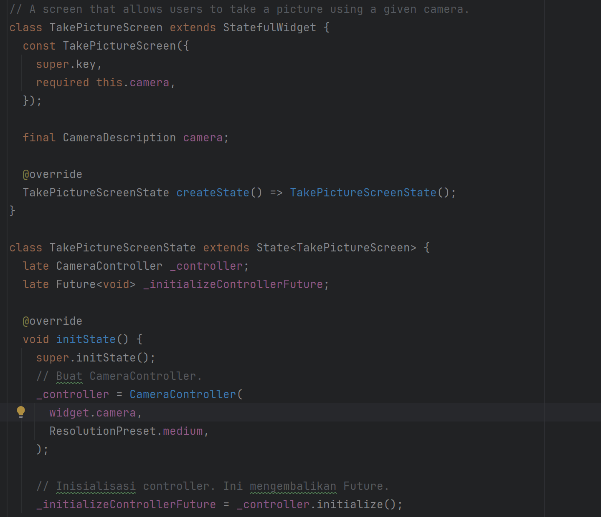
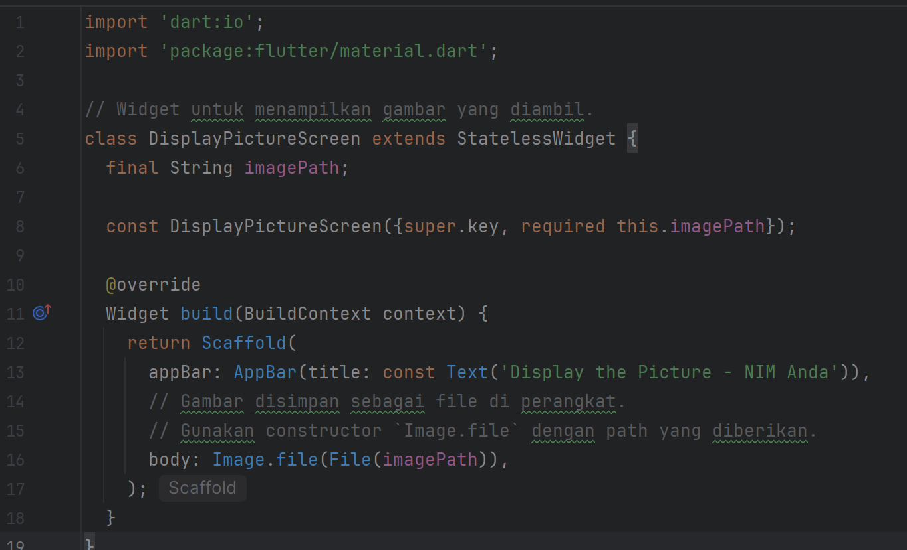
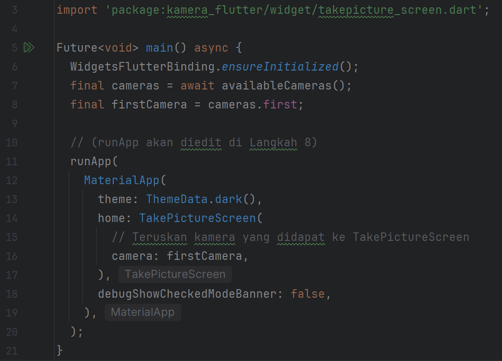
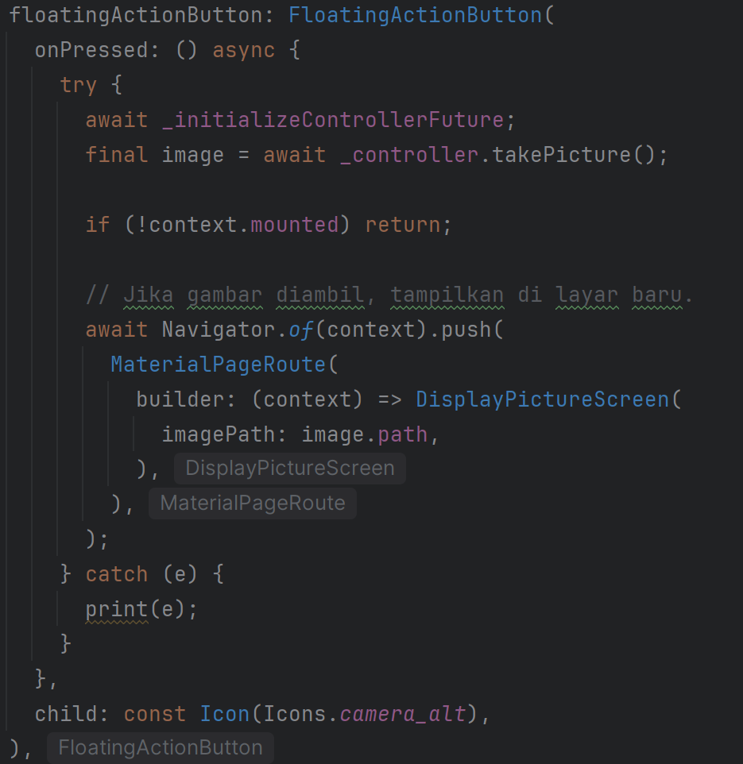

# Praktikum 1: Mengambil Foto dengan Kamera di Flutter

## Langkah 1: Buat Project Baru

Buatlah sebuah project flutter baru dengan nama kamera_flutter, lalu sesuaikan style laporan praktikum yang Anda buat.



## Langkah 2: Tambah dependensi yang diperlukan

Anda memerlukan tiga dependensi pada project flutter untuk menyelesaikan praktikum ini.

camera → menyediakan seperangkat alat untuk bekerja dengan kamera pada device.

path_provider → menyediakan lokasi atau path untuk menyimpan hasil foto.

path → membuat path untuk mendukung berbagai platform.

Untuk menambahkan dependensi plugin, jalankan perintah flutter pub add seperti berikut di terminal:

### flutter pub add camera path_provider path


## Langkah 3: Ambil Sensor Kamera

Selanjutnya, kita perlu mengecek jumlah kamera yang tersedia pada perangkat menggunakan plugin camera seperti pada kode berikut ini. Kode ini letakkan dalam void main().

lib/main.dart

```dart
import 'package:camera/camera.dart';
import 'package:flutter/material.dart';

// Tambahkan variabel global untuk kamera (meskipun nanti akan dilempar ke widget)
// Codelab meminta Anda mengambil 'firstCamera' di sini.

Future<void> main() async {
  // Pastikan plugin terinisialisasi
  WidgetsFlutterBinding.ensureInitialized();

  // Dapatkan daftar kamera
  final cameras = await availableCameras();

  // Ambil kamera pertama (biasanya kamera belakang)
  final firstCamera = cameras.first;

  // (runApp akan diedit di Langkah 8)
  runApp(
    // Placeholder sementara sampai Langkah 8
    MaterialApp(
      home: Scaffold(
        body: Center(
          child: Text('Menunggu Langkah 8...'),
        ),
      ),
    ),
  );
}
```
Output


## Langkah 4: Buat dan inisialisasi CameraController
Setelah Anda dapat mengakses kamera, gunakan langkah-langkah berikut untuk membuat dan menginisialisasi CameraController. Pada langkah berikut ini, Anda akan membuat koneksi ke kamera perangkat yang memungkinkan Anda untuk mengontrol kamera dan menampilkan pratinjau umpan kamera.

Buat StatefulWidget dengan kelas State pendamping.
Tambahkan variabel ke kelas State untuk menyimpan CameraController.
Tambahkan variabel ke kelas State untuk menyimpan Future yang dikembalikan dari CameraController.initialize().
Buat dan inisialisasi controller dalam metode initState().
Hapus controller dalam metode dispose().

lib/widget/takepicture_screen.dart

```dart
import 'package:camera/camera.dart';
import 'package:flutter/material.dart';

// A screen that allows users to take a picture using a given camera.
class TakePictureScreen extends StatefulWidget {
  const TakePictureScreen({
    super.key,
    required this.camera,
  });

  final CameraDescription camera;

  @override
  TakePictureScreenState createState() => TakePictureScreenState();
}

class TakePictureScreenState extends State<TakePictureScreen> {
  late CameraController _controller;
  late Future<void> _initializeControllerFuture;

  @override
  void initState() {
    super.initState();
    // Buat CameraController.
    _controller = CameraController(
      widget.camera,
      ResolutionPreset.medium,
    );

    // Inisialisasi controller. Ini mengembalikan Future.
    _initializeControllerFuture = _controller.initialize();
  }

  @override
  void dispose() {
    // Hapus controller saat widget dibuang.
    _controller.dispose();
    super.dispose();
  }

  @override
  Widget build(BuildContext context) {
    // (Akan diisi di Langkah 5)
    return Container();
  }
}
```
Output


## Langkah 5: Gunakan CameraPreview untuk menampilkan preview foto
Gunakan widget CameraPreview dari package camera untuk menampilkan preview foto. Anda perlu tipe objek void berupa FutureBuilder untuk menangani proses async.

lib/widget/takepicture_screen.dart

```dart
@override
Widget build(BuildContext context) {
  return Scaffold(
    appBar: AppBar(title: const Text('Take a picture - NIM Anda')),
    // Anda harus menunggu controller selesai inisialisasi
    body: FutureBuilder<void>(
      future: _initializeControllerFuture,
      builder: (context, snapshot) {
        if (snapshot.connectionState == ConnectionState.done) {
          // Jika Future selesai, tampilkan preview.
          return CameraPreview(_controller);
        } else {
          // Jika tidak, tampilkan loading indicator.
          return const Center(child: CircularProgressIndicator());
        }
      },
    ),
    // (FloatingActionButton akan ditambahkan di Langkah 6)
  );
}
```
Output


## Langkah 6: Ambil foto dengan CameraController
Anda dapat menggunakan CameraController untuk mengambil gambar menggunakan metode takePicture(), yang mengembalikan objek XFile, merupakan sebuah objek abstraksi File lintas platform yang disederhanakan. Pada Android dan iOS, gambar baru disimpan dalam direktori cache masing-masing, dan path ke lokasi tersebut dikembalikan dalam XFile.

Pada codelab ini, buatlah sebuah FloatingActionButton yang digunakan untuk mengambil gambar menggunakan CameraController saat pengguna mengetuk tombol.

Pengambilan gambar memerlukan 2 langkah:

Pastikan kamera telah diinisialisasi.
Gunakan controller untuk mengambil gambar dan pastikan ia mengembalikan objek Future.
Praktik baik untuk membungkus operasi kode ini dalam blok try / catch guna menangani berbagai kesalahan yang mungkin terjadi.

Kode berikut letakkan dalam Widget build setelah field body.

lib/widget/takepicture_screen.dart

```dart
@override
Widget build(BuildContext context) {
  return Scaffold(
    appBar: AppBar(title: const Text('Take a picture - NIM Anda')),
    body: FutureBuilder<void>(
      // ... (Kode FutureBuilder dari Langkah 5) ...
    ),
    floatingActionButton: FloatingActionButton(
      onPressed: () async {
        // Ambil gambar dalam try/catch block.
        try {
          // Pastikan kamera terinisialisasi.
          await _initializeControllerFuture;

          // Ambil gambar
          final image = await _controller.takePicture();

          // (Logika navigasi akan ditambahkan di Langkah 9)
        } catch (e) {
          // Jika error, log ke console.
          print(e);
        }
      },
      child: const Icon(Icons.camera_alt),
    ),
  );
}
```

Output


## Langkah 7: Buat widget baru DisplayPictureScreen
Buatlah file baru pada folder widget yang berisi kode berikut.

lib/widget/displaypicture_screen.dart

```dart
import 'dart:io';
import 'package:flutter/material.dart';

// Widget untuk menampilkan gambar yang diambil.
class DisplayPictureScreen extends StatelessWidget {
  final String imagePath;

  const DisplayPictureScreen({super.key, required this.imagePath});

  @override
  Widget build(BuildContext context) {
    return Scaffold(
      appBar: AppBar(title: const Text('Display the Picture - NIM Anda')),
      // Gambar disimpan sebagai file di perangkat.
      // Gunakan constructor `Image.file` dengan path yang diberikan.
      body: Image.file(File(imagePath)),
    );
  }
}
```
Output


## Langkah 8: Edit main.dart
Edit pada file ini bagian runApp seperti kode berikut.

lib/main.dart

```dart
// (Import jangan lupa ditambahkan)
import 'package:kamera_flutter/widget/takepicture_screen.dart'; // Sesuaikan path jika perlu

Future<void> main() async {
  WidgetsFlutterBinding.ensureInitialized();
  final cameras = await availableCameras();
  final firstCamera = cameras.first;

  runApp(
    MaterialApp(
      theme: ThemeData.dark(),
      home: TakePictureScreen(
        // Teruskan kamera yang didapat ke TakePictureScreen
        camera: firstCamera,
      ),
      debugShowCheckedModeBanner: false,
    ),
  );
}
```
Output


## Langkah 9: Menampilkan hasil foto
Tambahkan kode seperti berikut pada bagian try / catch agar dapat menampilkan hasil foto pada DisplayPictureScreen.

lib/widget/takepicture_screen.dart

```dart
// (Import jangan lupa ditambahkan)
import 'package:kamera_flutter/widget/displaypicture_screen.dart'; // Sesuaikan path

// ... (di dalam TakePictureScreenState) ...

floatingActionButton: FloatingActionButton(
  onPressed: () async {
    try {
      await _initializeControllerFuture;
      final image = await _controller.takePicture();

      if (!context.mounted) return;

      // Jika gambar diambil, tampilkan di layar baru.
      await Navigator.of(context).push(
        MaterialPageRoute(
          builder: (context) => DisplayPictureScreen(
            imagePath: image.path,
          ),
        ),
      );
    } catch (e) {
      print(e);
    }
  },
  child: const Icon(Icons.camera_alt),
),
```
Output
