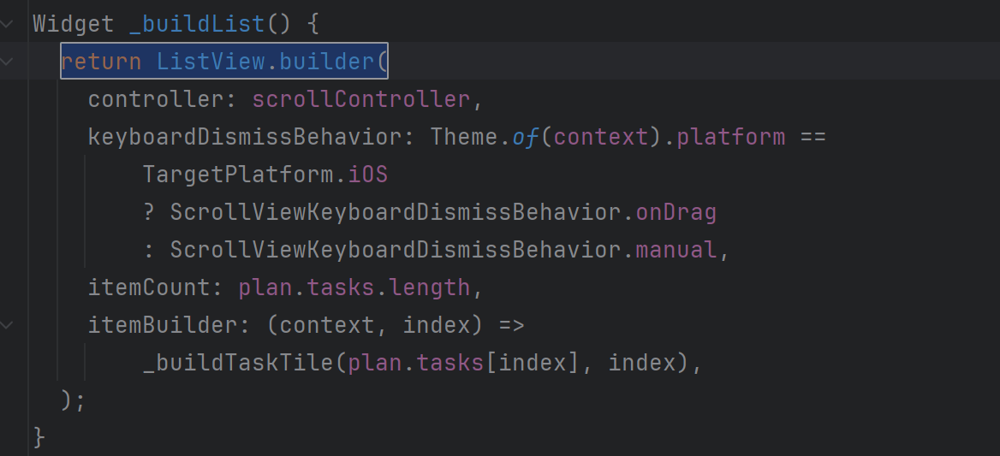

# Praktikum 1: Dasar State dengan Model-View

## Langkah 1: Buat Project Baru
Buatlah sebuah project flutter baru dengan nama master_plan di folder src week-10 repository 
GitHub Anda atau sesuai style laporan praktikum yang telah disepakati. Lalu buatlah susunan folder dalam project seperti gambar berikut ini.


## Langkah 2: Membuat model task.dart

Praktik terbaik untuk memulai adalah pada lapisan data (data layer). Ini akan memberi Anda gambaran yang jelas tentang aplikasi Anda, 
tanpa masuk ke detail antarmuka pengguna Anda. Di folder model, buat file bernama task.dart dan buat class Task. Class ini memiliki atribut description dengan tipe data String dan complete dengan tipe data Boolean, 
serta ada konstruktor. Kelas ini akan menyimpan data tugas untuk aplikasi kita. Tambahkan kode berikut: 

```dart
class Task {
  final String description;
  final bool complete;
  
  const Task({
    this.complete = false,
    this.description = '',
  });
}
```
#### Code Penjelasan


## Langkah 3: Buat file plan.dart
Kita juga perlu sebuah List untuk menyimpan daftar rencana dalam aplikasi to-do ini. Buat file plan.dart di dalam folder models dan isi kode seperti berikut.
```dart
import './task.dart';

class Plan {
  final String name;
  final List<Task> tasks;

  const Plan({this.name = '', this.tasks = const []});
}
```
#### Code Penjelasan


## Langkah 4: Buat file data_layer.dart
Kita dapat membungkus beberapa data layer ke dalam sebuah file yang nanti akan mengekspor kedua model tersebut. Dengan begitu, 
proses impor akan lebih ringkas seiring berkembangnya aplikasi. Buat file bernama data_layer.dart di folder models. Kodenya hanya berisi export seperti berikut.

```dart
export 'plan.dart';
export 'task.dart';
```
#### Code Penjelasan


## Langkah 5: Pindah ke file main.dart
Hapus semua kode yang ada di dalam main.dart dan ganti dengan kode ini

```dart
import 'package:flutter/material.dart';
import './views/plan_screen.dart';

void main() => runApp(MasterPlanApp());

class MasterPlanApp extends StatelessWidget {
  const MasterPlanApp({super.key});

  @override
  Widget build(BuildContext context) {
    return MaterialApp(
     theme: ThemeData(primarySwatch: Colors.purple),
     home: PlanScreen(), 
    );
  }
}
```
**#### Code Penjelasan**


## Langkah 6: buat plan_screen.dart
Pada folder views, buatlah sebuah file plan_screen.dart dan gunakan templat StatefulWidget untuk membuat class PlanScreen. 
Isi kodenya adalah sebagai berikut. Gantilah teks ‘Namaku' dengan nama panggilan Anda pada title AppBar.

````dart
import '../models/data_layer.dart';
import 'package:flutter/material.dart';

class PlanScreen extends StatefulWidget {
  const PlanScreen({super.key});

  @override
  State createState() => _PlanScreenState();
}

class _PlanScreenState extends State<PlanScreen> {
  Plan plan = const Plan();

  @override
  Widget build(BuildContext context) {
   return Scaffold(
   
    appBar: AppBar(title: const Text('Master Plan Muhammad Rifda Musyaffa')),
    body: _buildList(), 
    floatingActionButton: _buildAddTaskButton(), 
   );
  }
}
````

**#### Code Penjelasan**


## Langkah 7: buat method _buildAddTaskButton()
Anda akan melihat beberapa error di langkah 6, karena method yang belum dibuat.
Ayo kita buat mulai dari yang paling mudah yaitu tombol Tambah Rencana. Tambah
kode berikut di bawah method build di dalam class _PlanScreenState.

```dart
Widget _buildAddTaskButton() {
    return FloatingActionButton(
     child: const Icon(Icons.add),
     onPressed: () {
       setState(() {
        plan = Plan(
         name: plan.name,
         tasks: List<Task>.from(plan.tasks)
         ..add(const Task()),
       );
      });
     },
    );
  }
```

**#### Code Penjelasan**


## Langkah 8: buat widget _buildList()
Kita akan buat widget berupa List yang dapat dilakukan scroll, yaitu ListView.builder.
Buat widget ListView seperti kode berikut ini.
```dart
Widget _buildList() {
    return ListView.builder(
     itemCount: plan.tasks.length,
     itemBuilder: (context, index) =>
     _buildTaskTile(plan.tasks[index], index), 
    );
  }
```

**#### Code Penjelasan**


## Langkah 9: buat widget _buildTaskTile()
Dari langkah 8, kita butuh ListTile untuk menampilkan setiap nilai dari plan.tasks. Kita
buat dinamis untuk setiap index data, sehingga membuat view menjadi lebih mudah. Tambahkan kode berikut ini

```dart
Widget _buildTaskTile(Task task, int index) {
    return ListTile(
      leading: Checkbox(
          value: task.complete,
          onChanged: (selected) {
            setState(() {
              plan = Plan(
                name: plan.name,
                tasks: List<Task>.from(plan.tasks)
                  ..[index] = Task(
                    description: task.description,
                    complete: selected ?? false,
                  ),
              );
            });
          }),
      title: TextFormField(
        initialValue: task.description,
        onChanged: (text) {
          setState(() {
            plan = Plan(
              name: plan.name,
              tasks: List<Task>.from(plan.tasks)
                ..[index] = Task(
                  description: text,
                  complete: task.complete,
                ),
            );
          });
        },
      ),
    );
  }
```

**#### Code Penjelasan**


## Langkah 10: Tambah Scroll Controller
Anda dapat menambah tugas sebanyak-banyaknya, menandainya jika sudah beres, dan melakukan scroll jika sudah semakin banyak isinya. Namun, ada salah satu fitur tertentu di iOS perlu kita tambahkan. Ketika keyboard tampil, Anda akan kesulitan untuk mengisi yang paling bawah. Untuk mengatasi itu, 
Anda dapat menggunakan ScrollController untuk menghapus focus dari semua TextField selama event scroll dilakukan. Pada file plan_screen.dart, tambahkan variabel scroll controller di class State tepat setelah variabel plan.

```dart
late ScrollController scrollController;
```
**#### Code Penjelasan**


## Langkah 11: Tambah Scroll Listener'

Tambahkan method initState() setelah deklarasi variabel scrollController seperti kode berikut.

```dart
@override
  void initState() {
    super.initState();
    scrollController = ScrollController()
      ..addListener(() {
        FocusScope.of(context).requestFocus(FocusNode());
      });
  }
```
**#### Code Penjelasan**


## Langkah 12: Tambah controller dan keyboard behavior
Tambahkan controller dan keyboard behavior pada ListView di method _buildList seperti kode berikut ini.

```dart
return ListView.builder(
  controller: scrollController,
 keyboardDismissBehavior: Theme.of(context).platform ==
 TargetPlatform.iOS
          ? ScrollViewKeyboardDismissBehavior.onDrag
          : ScrollViewKeyboardDismissBehavior.manual,
```

**#### Code Penjelasan**


## Langkah 13: Terakhir, tambah method dispose()

Terakhir, tambahkan method dispose() berguna ketika widget sudah tidak digunakan lagi.

```dart
@override
  void dispose() {
    scrollController.dispose();
    super.dispose();
  }
```

**#### Code Penjelasan**


## HASIL


## Tugas Praktikum 1: Dasar State dengan Model-View
Selesaikan langkah-langkah praktikum tersebut, lalu dokumentasikan berupa GIF hasil akhir praktikum beserta penjelasannya di file README.md! Jika Anda menemukan ada yang error atau tidak berjalan dengan baik, silakan diperbaiki.

Jelaskan maksud dari langkah 4 pada praktikum tersebut! Mengapa dilakukan demikian?

Mengapa perlu variabel plan di langkah 6 pada praktikum tersebut? Mengapa dibuat konstanta ?

Lakukan capture hasil dari Langkah 9 berupa GIF, kemudian jelaskan apa yang telah Anda buat!

Apa kegunaan method pada Langkah 11 dan 13 dalam lifecyle state ?

Kumpulkan laporan praktikum Anda berupa link commit atau repository GitHub ke dosen yang telah disepakati !

### Jawab:
1. Maksud dari Langkah 4 (data_layer.dart)
Langkah 4 adalah praktik pengorganisasian kode yang baik. File data_layer.dart dibuat sebagai file "pembungkus" (exporter).
Isinya hanya:
```dart
export 'plan.dart';
export 'task.dart';
```

Mengapa dilakukan demikian?
Tujuannya adalah untuk menyederhanakan proses import di file lain.

* Tanpa data_layer.dart: Jika file plan_screen.dart membutuhkan kedua model, Anda harus mengimpornya satu per satu:
```dart
import '../models/plan.dart';
import '../models/task.dart';
```
* Dengan data_layer.dart: Anda hanya perlu mengimpor satu file:
```dart
import '../models/data_layer.dart';
```
Ini membuat kode lebih bersih dan mudah dikelola, terutama saat aplikasi berkembang dan jumlah model bertambah.

2. Variabel plan di Langkah 6 

Mengapa perlu variabel plan?
Variabel plan (Plan plan = const Plan();) adalah state (data) utama untuk halaman PlanScreen. 
Variabel inilah yang menyimpan semua informasi yang perlu ditampilkan di layar, yaitu daftar tugas (List<Task>).

* _buildList() membaca dari variabel plan ini untuk tahu tugas apa saja yang harus ditampilkan.
* _buildAddTaskButton() memodifikasi variabel plan untuk menambah tugas baru.
* _buildTaskTile() juga memodifikasi variabel plan untuk memperbarui status tugas (misalnya menandai tugas sebagai selesai atau mengubah deskripsi tugas).

Mengapa dibuat const Plan()?
Membuatnya sebagai const Plan() memberikan beberapa keuntungan:
* Immutability: Objek Plan yang dibuat dengan const bersifat immutable (tidak dapat diubah). Ini membantu mencegah perubahan tidak sengaja pada data, yang penting dalam manajemen state.
  * Performance: Objek const dapat dioptimalkan oleh Dart, sehingga penggunaan memori menjadi
  * lebih efisien.
  * Predictability: Dengan menggunakan const, Anda memastikan bahwa objek Plan awal selalu dalam keadaan default (kosong), sehingga memudahkan debugging dan pengujian.
  * Konsistensi: Setiap kali Anda membuat Plan baru tanpa parameter, Anda mendapatkan instance yang sama, yang dapat membantu dalam perbandingan dan pengujian.
  * Best Practice: Menggunakan const untuk objek yang tidak perlu diubah adalah praktik yang baik dalam pemrograman Dart/Flutter, karena membantu menjaga kode tetap bersih dan efisien.

3. Hasil dari Langkah 9 (Simulasi GIF)
   Saya tidak dapat membuat file GIF, tetapi saya akan menjelaskan apa yang akan Anda lihat di hasil Langkah 9 jika Anda merekamnya:

4. Kegunaan Method initState dan dispose
Kedua method ini adalah bagian penting dari "Siklus Hidup" (Lifecycle) sebuah StatefulWidget.
* initState():
  * Kegunaan: Method ini dipanggil sekali ketika State objek dibuat. Ini adalah tempat yang tepat untuk menginisialisasi data atau sumber daya yang dibutuhkan oleh widget.
  * Dalam konteks praktikum, initState() digunakan untuk menginisialisasi ScrollController dan menambahkan listener padanya. Listener ini akan merespons event scroll dengan menghapus fokus dari semua TextField, yang penting untuk pengalaman pengguna di iOS.
dispose() (Langkah 13)
  * Kegunaan: Method ini dipanggil ketika State objek akan dihapus dari pohon widget. Ini adalah tempat yang tepat untuk membersihkan sumber daya yang tidak lagi dibutuhkan.
  * Dalam konteks praktikum, dispose() digunakan untuk membuang (dispose) ScrollController ketika widget tidak lagi digunakan. Ini penting untuk mencegah memory leaks, karena ScrollController mungkin masih mendengarkan event scroll bahkan setelah widget dihapus jika tidak dibuang dengan benar.
Dengan menggunakan initState() dan dispose() dengan benar, Anda memastikan bahwa sumber daya dikelola dengan baik, yang meningkatkan kinerja aplikasi dan mencegah potensi masalah memori.

## Praktikum 2: Mengelola Data Layer dengan InheritedWidget dan InheritedNotifier
Bagaimana seharusnya Anda mengakses data pada aplikasi?

Beberapa pilihan yang bisa dilakukan adalah meletakkan data dalam satu kelas yang sama sehingga menjadi bagian dari life cycle aplikasi Anda.

Kemudian muncul pertanyaan, bagaimana meletakkan model dalam pohon widget ? sedangkan model bukanlah widget, sehingga tidak akan tampil pada screen.

Solusi yang memungkinkan adalah menggunakan InheritedWidget. Sejauh ini kita hanya menggunakan dua jenis widget, yaitu StatelessWidget dan StatefulWidget. Kedua widget tersebut digunakan untuk layouting UI di screen. Di mana satu bersifat statis dan dinamis. 
Sedangkan InheritedWidget itu berbeda, ia dapat meneruskan data ke sub-widget turunannya (biasanya ketika Anda menerapkan decomposition widget). Jika dilihat dari perspektif user, itu tidak akan terlihat prosesnya (invisible). InheritedWidget dapat digunakan sebagai pintu untuk komunikasi antara view dan data layers.

Pada codelab ini, kita akan memperbarui kode dari aplikasi Master Plan dengan memisahkan data todo list ke luar class view-nya.

Setelah Anda menyelesaikan praktikum 1, Anda dapat melanjutkan praktikum 2 ini. Selesaikan langkah-langkah praktikum berikut ini menggunakan editor Visual Studio Code (VS Code) atau Android Studio atau code editor lain kesukaan Anda.

## Langkah 1: Buat file plan_notifier.dart
Buat folder baru provider di dalam folder lib, lalu buat file baru dengan nama plan_provider.dart berisi kode seperti berikut.


**Code Penjelasan**
```dart
import 'package:flutter/material.dart';
import '../models/data_layer.dart';

class PlanProvider extends InheritedNotifier<ValueNotifier<Plan>> {
  const PlanProvider({super.key, required Widget child, required
   ValueNotifier<Plan> notifier})
  : super(child: child, notifier: notifier);

  static ValueNotifier<Plan> of(BuildContext context) {
   return context.
    dependOnInheritedWidgetOfExactType<PlanProvider>()!.notifier!;
  }
}
```
**Code Penjelasan**


## Langkah 2: Perbarui file main.dart
Pada file main.dart, impor plan_provider.dart dan perbarui kode seperti berikut ini.
```dart
import 'package:flutter/material.dart';
import './views/plan_screen.dart';
import './provider/plan_provider.dart';
import './models/data_layer.dart';

void main() => runApp(MasterPlanApp());

class MasterPlanApp extends StatelessWidget {
  const MasterPlanApp({super.key});

  @override
  Widget build(BuildContext context) {
    return MaterialApp(
      theme: ThemeData(primarySwatch: Colors.purple),
      home: PlanProvider(
        notifier: ValueNotifier<Plan>(const Plan()),
        child: const PlanScreen(),
      ),
    );
  }
}
```
**Code Penjelasan**


## Langkah 3: Tambah method pada model plan.dart
Tambahkan dua method di dalam model class Plan sepe rti kode berikut.

```dart
int get completedCount => tasks
  .where((task) => task.complete)
  .length;

String get completenessMessage =>
  '$completedCount out of ${tasks.length} tasks';
```

**Code Penjelasan**


## Langkah 4: Pindah ke PlanScreen
Edit PlanScreen agar menggunakan data dari PlanProvider. Hapus deklarasi variabel plan (ini akan membuat error). Kita akan perbaiki pada langkah 5 berikut ini.

```dart
Plan plan = const Plan(); // <-- HAPUS BARIS INI
```

**Code Penjelasan**


## Langkah 5: Edit method _buildAddTaskButton
Tambahkan BuildContext sebagai parameter dan gunakan PlanProvider sebagai sumber datanya. Edit bagian kode seperti berikut.
```dart
Widget _buildAddTaskButton(BuildContext context) {
  ValueNotifier<Plan> planNotifier = PlanProvider.of(context);
  return FloatingActionButton(
    child: const Icon(Icons.add),
    onPressed: () {
      Plan currentPlan = planNotifier.value;
      planNotifier.value = Plan(
        name: currentPlan.name,
        tasks: List<Task>.from(currentPlan.tasks)..add(const Task()),
      );
    },
  );
}
```

**Code Penjelasan**


## Langkah 6: Edit method _buildList
Tambahkan parameter BuildContext, gunakan PlanProvider sebagai sumber data. 
Ganti TextField menjadi TextFormField untuk membuat inisial data provider menjadi lebih mudah.

```dart
Widget _buildTaskTile(Task task, int index, BuildContext context) {
  ValueNotifier<Plan> planNotifier = PlanProvider.of(context);
  return ListTile(
    leading: Checkbox(
       value: task.complete,
       onChanged: (selected) {
         Plan currentPlan = planNotifier.value;
         planNotifier.value = Plan(
           name: currentPlan.name,
           tasks: List<Task>.from(currentPlan.tasks)
             ..[index] = Task(
               description: task.description,
               complete: selected ?? false,
             ),
         );
       }),
    title: TextFormField(
      initialValue: task.description,
      onChanged: (text) {
        Plan currentPlan = planNotifier.value;
        planNotifier.value = Plan(
          name: currentPlan.name,
          tasks: List<Task>.from(currentPlan.tasks)
            ..[index] = Task(
              description: text,
              complete: task.complete,
            ),
        );
      },
    ),
  );
}
```

**Code Penjelasan**


