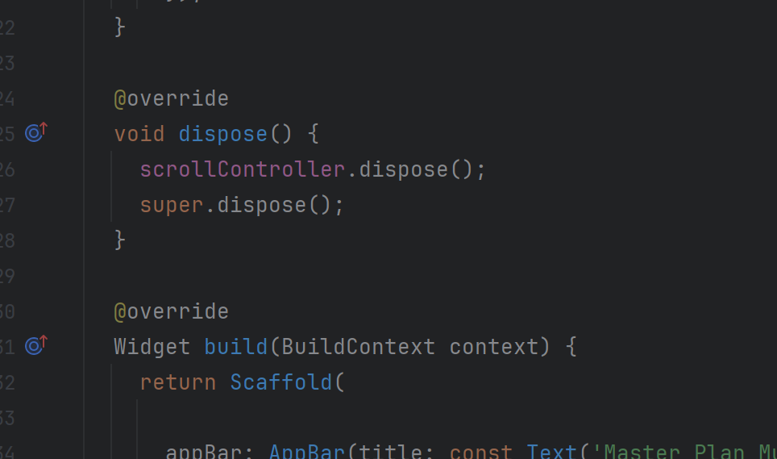

# Praktikum 1: Dasar State dengan Model-View

## Langkah 1: Buat Project Baru
Buatlah sebuah project flutter baru dengan nama master_plan di folder src week-10 repository 
GitHub Anda atau sesuai style laporan praktikum yang telah disepakati. Lalu buatlah susunan folder dalam project seperti gambar berikut ini.


## Langkah 2: Membuat model task.dart

Praktik terbaik untuk memulai adalah pada lapisan data (data layer). Ini akan memberi Anda gambaran yang jelas tentang aplikasi Anda, 
tanpa masuk ke detail antarmuka pengguna Anda. Di folder model, buat file bernama task.dart dan buat class Task. Class ini memiliki atribut description dengan tipe data String dan complete dengan tipe data Boolean, 
serta ada konstruktor. Kelas ini akan menyimpan data tugas untuk aplikasi kita. Tambahkan kode berikut: 

```dart
class Task {
  final String description;
  final bool complete;
  
  const Task({
    this.complete = false,
    this.description = '',
  });
}
```
#### Code Penjelasan


## Langkah 3: Buat file plan.dart
Kita juga perlu sebuah List untuk menyimpan daftar rencana dalam aplikasi to-do ini. Buat file plan.dart di dalam folder models dan isi kode seperti berikut.
```dart
import './task.dart';

class Plan {
  final String name;
  final List<Task> tasks;

  const Plan({this.name = '', this.tasks = const []});
}
```
#### Code Penjelasan


## Langkah 4: Buat file data_layer.dart
Kita dapat membungkus beberapa data layer ke dalam sebuah file yang nanti akan mengekspor kedua model tersebut. Dengan begitu, 
proses impor akan lebih ringkas seiring berkembangnya aplikasi. Buat file bernama data_layer.dart di folder models. Kodenya hanya berisi export seperti berikut.

```dart
export 'plan.dart';
export 'task.dart';
```
#### Code Penjelasan


## Langkah 5: Pindah ke file main.dart
Hapus semua kode yang ada di dalam main.dart dan ganti dengan kode ini

```dart
import 'package:flutter/material.dart';
import './views/plan_screen.dart';

void main() => runApp(MasterPlanApp());

class MasterPlanApp extends StatelessWidget {
  const MasterPlanApp({super.key});

  @override
  Widget build(BuildContext context) {
    return MaterialApp(
     theme: ThemeData(primarySwatch: Colors.purple),
     home: PlanScreen(), 
    );
  }
}
```
**#### Code Penjelasan**


## Langkah 6: buat plan_screen.dart
Pada folder views, buatlah sebuah file plan_screen.dart dan gunakan templat StatefulWidget untuk membuat class PlanScreen. 
Isi kodenya adalah sebagai berikut. Gantilah teks ‘Namaku' dengan nama panggilan Anda pada title AppBar.

````dart
import '../models/data_layer.dart';
import 'package:flutter/material.dart';

class PlanScreen extends StatefulWidget {
  const PlanScreen({super.key});

  @override
  State createState() => _PlanScreenState();
}

class _PlanScreenState extends State<PlanScreen> {
  Plan plan = const Plan();

  @override
  Widget build(BuildContext context) {
   return Scaffold(
   
    appBar: AppBar(title: const Text('Master Plan Muhammad Rifda Musyaffa')),
    body: _buildList(), 
    floatingActionButton: _buildAddTaskButton(), 
   );
  }
}
````

**#### Code Penjelasan**


## Langkah 7: buat method _buildAddTaskButton()
Anda akan melihat beberapa error di langkah 6, karena method yang belum dibuat.
Ayo kita buat mulai dari yang paling mudah yaitu tombol Tambah Rencana. Tambah
kode berikut di bawah method build di dalam class _PlanScreenState.

```dart
Widget _buildAddTaskButton() {
    return FloatingActionButton(
     child: const Icon(Icons.add),
     onPressed: () {
       setState(() {
        plan = Plan(
         name: plan.name,
         tasks: List<Task>.from(plan.tasks)
         ..add(const Task()),
       );
      });
     },
    );
  }
```

**#### Code Penjelasan**


## Langkah 8: buat widget _buildList()
Kita akan buat widget berupa List yang dapat dilakukan scroll, yaitu ListView.builder.
Buat widget ListView seperti kode berikut ini.
```dart
Widget _buildList() {
    return ListView.builder(
     itemCount: plan.tasks.length,
     itemBuilder: (context, index) =>
     _buildTaskTile(plan.tasks[index], index), 
    );
  }
```

**#### Code Penjelasan**


## Langkah 9: buat widget _buildTaskTile()
Dari langkah 8, kita butuh ListTile untuk menampilkan setiap nilai dari plan.tasks. Kita
buat dinamis untuk setiap index data, sehingga membuat view menjadi lebih mudah. Tambahkan kode berikut ini

```dart
Widget _buildTaskTile(Task task, int index) {
    return ListTile(
      leading: Checkbox(
          value: task.complete,
          onChanged: (selected) {
            setState(() {
              plan = Plan(
                name: plan.name,
                tasks: List<Task>.from(plan.tasks)
                  ..[index] = Task(
                    description: task.description,
                    complete: selected ?? false,
                  ),
              );
            });
          }),
      title: TextFormField(
        initialValue: task.description,
        onChanged: (text) {
          setState(() {
            plan = Plan(
              name: plan.name,
              tasks: List<Task>.from(plan.tasks)
                ..[index] = Task(
                  description: text,
                  complete: task.complete,
                ),
            );
          });
        },
      ),
    );
  }
```

**#### Code Penjelasan**


## Langkah 10: Tambah Scroll Controller
Anda dapat menambah tugas sebanyak-banyaknya, menandainya jika sudah beres, dan melakukan scroll jika sudah semakin banyak isinya. Namun, ada salah satu fitur tertentu di iOS perlu kita tambahkan. Ketika keyboard tampil, Anda akan kesulitan untuk mengisi yang paling bawah. Untuk mengatasi itu, 
Anda dapat menggunakan ScrollController untuk menghapus focus dari semua TextField selama event scroll dilakukan. Pada file plan_screen.dart, tambahkan variabel scroll controller di class State tepat setelah variabel plan.

```dart
late ScrollController scrollController;
```
**#### Code Penjelasan**


## Langkah 11: Tambah Scroll Listener'

Tambahkan method initState() setelah deklarasi variabel scrollController seperti kode berikut.

```dart
@override
  void initState() {
    super.initState();
    scrollController = ScrollController()
      ..addListener(() {
        FocusScope.of(context).requestFocus(FocusNode());
      });
  }
```
**#### Code Penjelasan**


## Langkah 12: Tambah controller dan keyboard behavior
Tambahkan controller dan keyboard behavior pada ListView di method _buildList seperti kode berikut ini.

```dart
return ListView.builder(
  controller: scrollController,
 keyboardDismissBehavior: Theme.of(context).platform ==
 TargetPlatform.iOS
          ? ScrollViewKeyboardDismissBehavior.onDrag
          : ScrollViewKeyboardDismissBehavior.manual,
```

**#### Code Penjelasan**


## Langkah 13: Terakhir, tambah method dispose()

Terakhir, tambahkan method dispose() berguna ketika widget sudah tidak digunakan lagi.

```dart
@override
  void dispose() {
    scrollController.dispose();
    super.dispose();
  }
```

**#### Code Penjelasan**


## HASIL

